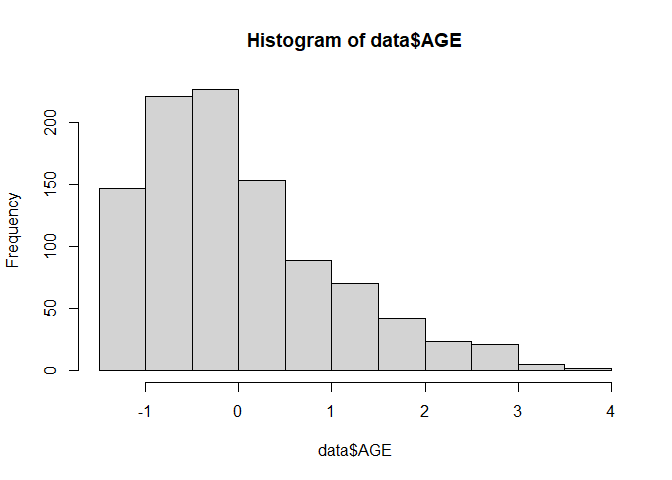
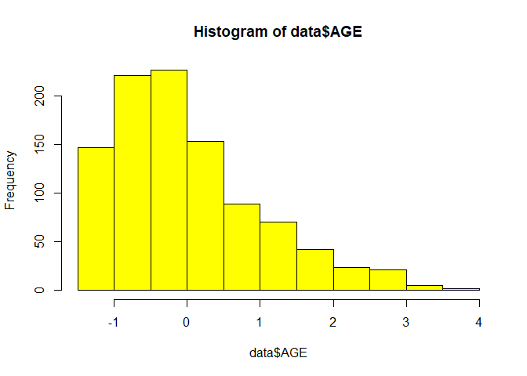
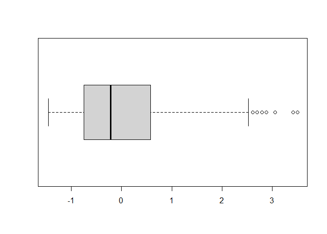
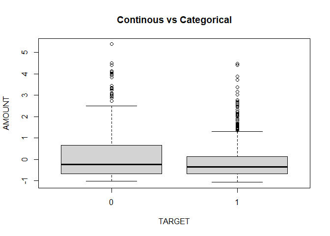
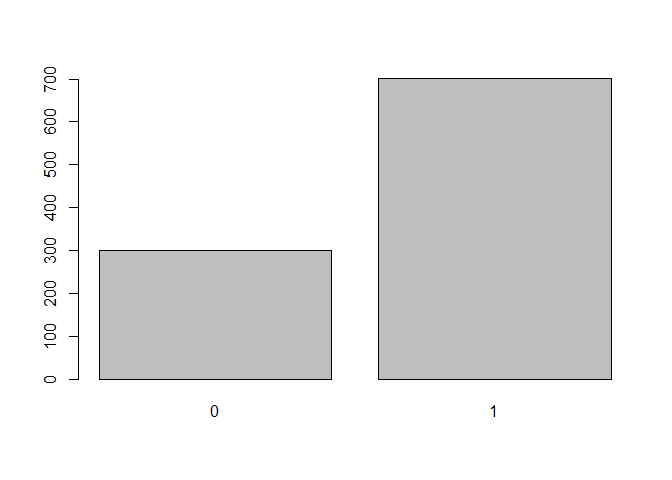
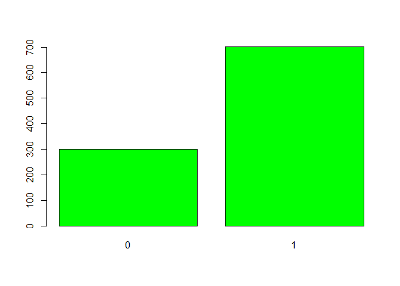
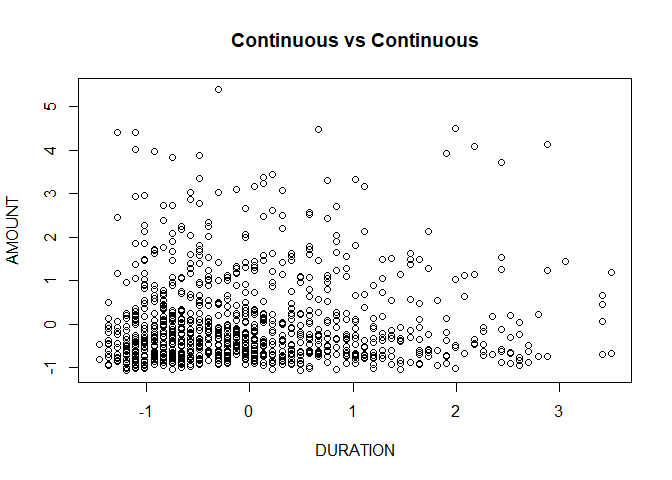

Data PreProcessing
================
Aadil
28/09/2020

``` r
#Get and set working directory
getwd()
```

    ## [1] "E:/ML"

``` r
setwd("E:/ML")

#Importing CSV file
readLines(con='German-Credit_1.csv',n=5)
```

    ## [1] "OBS,DURATION,NEW_CAR,USED_CAR,FURNITURE,RADIO_TV,EDUCATION,RETRAINING,AMOUNT,INSTALL_RATE,CO_APPLICANT,GUARANTOR,REAL_ESTATE,PROP_UNKN_NONE,AGE,OTHER_INSTALL,RENT,OWN_RES,NUM_CREDITS,NUM_DEPENDENTS,TELEPHONE,FOREIGN,RESPONSE"
    ## [2] "1,6,0,0,0,1,0,0,1169,4,0,0,1,0,67,0,0,1,2,1,1,0,1"                                                                                                                                                                               
    ## [3] "2,48,0,0,0,1,0,0,5951,2,0,0,1,0,22,0,0,1,1,1,0,0,0"                                                                                                                                                                              
    ## [4] "3,12,0,0,0,0,1,0,2096,2,0,0,1,0,49,0,0,1,1,2,0,0,1"                                                                                                                                                                              
    ## [5] "4,42,0,0,1,0,0,0,7882,2,0,1,0,0,45,0,0,0,1,2,0,0,1"

``` r
df1<-read.table(file="German-Credit_1.csv",header = T,sep = ",")
head(df1)
```

    ##   OBS DURATION NEW_CAR USED_CAR FURNITURE RADIO_TV EDUCATION RETRAINING AMOUNT
    ## 1   1        6       0        0         0        1         0          0   1169
    ## 2   2       48       0        0         0        1         0          0   5951
    ## 3   3       12       0        0         0        0         1          0   2096
    ## 4   4       42       0        0         1        0         0          0   7882
    ## 5   5       24       1        0         0        0         0          0   4870
    ## 6   6       36       0        0         0        0         1          0   9055
    ##   INSTALL_RATE CO_APPLICANT GUARANTOR REAL_ESTATE PROP_UNKN_NONE AGE
    ## 1            4            0         0           1              0  67
    ## 2            2            0         0           1              0  22
    ## 3            2            0         0           1              0  49
    ## 4            2            0         1           0              0  45
    ## 5            3            0         0           0              1  53
    ## 6            2            0         0           0              1  35
    ##   OTHER_INSTALL RENT OWN_RES NUM_CREDITS NUM_DEPENDENTS TELEPHONE FOREIGN
    ## 1             0    0       1           2              1         1       0
    ## 2             0    0       1           1              1         0       0
    ## 3             0    0       1           1              2         0       0
    ## 4             0    0       0           1              2         0       0
    ## 5             0    0       0           2              2         0       0
    ## 6             0    0       0           1              2         1       0
    ##   RESPONSE
    ## 1        1
    ## 2        0
    ## 3        1
    ## 4        1
    ## 5        0
    ## 6        1

``` r
library(XLConnect)
```

    ## XLConnect 1.0.1 by Mirai Solutions GmbH [aut],
    ##   Martin Studer [cre],
    ##   The Apache Software Foundation [ctb, cph] (Apache POI),
    ##   Graph Builder [ctb, cph] (Curvesapi Java library)

    ## http://www.mirai-solutions.com
    ## https://github.com/miraisolutions/xlconnect

``` r
df2<-read.table(file="German-Credit_2.csv",header = T,sep = ",")
head(df2)
```

    ##   OBS CHK_ACCT HISTORY SAV_ACCT EMPLOYMENT PRESENT_RESIDENT JOB
    ## 1   1        0       4        4          4                4   2
    ## 2   2        1       2        0          2                2   2
    ## 3   3        3       4        0          3                3   1
    ## 4   4        0       2        0          3                4   2
    ## 5   5        0       3        0          2                4   2
    ## 6   6        3       2        4          2                4   1

``` r
#reading columnnnames of df1 and df2
colnames(df1)
```

    ##  [1] "OBS"            "DURATION"       "NEW_CAR"        "USED_CAR"      
    ##  [5] "FURNITURE"      "RADIO_TV"       "EDUCATION"      "RETRAINING"    
    ##  [9] "AMOUNT"         "INSTALL_RATE"   "CO_APPLICANT"   "GUARANTOR"     
    ## [13] "REAL_ESTATE"    "PROP_UNKN_NONE" "AGE"            "OTHER_INSTALL" 
    ## [17] "RENT"           "OWN_RES"        "NUM_CREDITS"    "NUM_DEPENDENTS"
    ## [21] "TELEPHONE"      "FOREIGN"        "RESPONSE"

``` r
colnames(df2)
```

    ## [1] "OBS"              "CHK_ACCT"         "HISTORY"          "SAV_ACCT"        
    ## [5] "EMPLOYMENT"       "PRESENT_RESIDENT" "JOB"

``` r
#merging two dataframes
df3<- merge(x = df1 ,y = df2, by = "OBS", all = T)
head(df3)
```

    ##   OBS DURATION NEW_CAR USED_CAR FURNITURE RADIO_TV EDUCATION RETRAINING AMOUNT
    ## 1   1        6       0        0         0        1         0          0   1169
    ## 2   2       48       0        0         0        1         0          0   5951
    ## 3   3       12       0        0         0        0         1          0   2096
    ## 4   4       42       0        0         1        0         0          0   7882
    ## 5   5       24       1        0         0        0         0          0   4870
    ## 6   6       36       0        0         0        0         1          0   9055
    ##   INSTALL_RATE CO_APPLICANT GUARANTOR REAL_ESTATE PROP_UNKN_NONE AGE
    ## 1            4            0         0           1              0  67
    ## 2            2            0         0           1              0  22
    ## 3            2            0         0           1              0  49
    ## 4            2            0         1           0              0  45
    ## 5            3            0         0           0              1  53
    ## 6            2            0         0           0              1  35
    ##   OTHER_INSTALL RENT OWN_RES NUM_CREDITS NUM_DEPENDENTS TELEPHONE FOREIGN
    ## 1             0    0       1           2              1         1       0
    ## 2             0    0       1           1              1         0       0
    ## 3             0    0       1           1              2         0       0
    ## 4             0    0       0           1              2         0       0
    ## 5             0    0       0           2              2         0       0
    ## 6             0    0       0           1              2         1       0
    ##   RESPONSE CHK_ACCT HISTORY SAV_ACCT EMPLOYMENT PRESENT_RESIDENT JOB
    ## 1        1        0       4        4          4                4   2
    ## 2        0        1       2        0          2                2   2
    ## 3        1        3       4        0          3                3   1
    ## 4        1        0       2        0          3                4   2
    ## 5        0        0       3        0          2                4   2
    ## 6        1        3       2        4          2                4   1

``` r
summary(df1)
```

    ##       OBS            DURATION        NEW_CAR          USED_CAR     
    ##  Min.   :   1.0   Min.   : 4.00   Min.   :0.0000   Min.   :0.0000  
    ##  1st Qu.: 250.8   1st Qu.:12.00   1st Qu.:0.0000   1st Qu.:0.0000  
    ##  Median : 500.5   Median :18.00   Median :0.0000   Median :0.0000  
    ##  Mean   : 500.5   Mean   :20.92   Mean   :0.2342   Mean   :0.1031  
    ##  3rd Qu.: 750.2   3rd Qu.:24.00   3rd Qu.:0.0000   3rd Qu.:0.0000  
    ##  Max.   :1000.0   Max.   :72.00   Max.   :1.0000   Max.   :1.0000  
    ##                   NA's   :2       NA's   :1        NA's   :1       
    ##    FURNITURE         RADIO_TV        EDUCATION        RETRAINING     
    ##  Min.   :0.0000   Min.   :0.0000   Min.   :0.0000   Min.   :0.00000  
    ##  1st Qu.:0.0000   1st Qu.:0.0000   1st Qu.:0.0000   1st Qu.:0.00000  
    ##  Median :0.0000   Median :0.0000   Median :0.0000   Median :0.00000  
    ##  Mean   :0.1802   Mean   :0.2798   Mean   :0.0502   Mean   :0.09739  
    ##  3rd Qu.:0.0000   3rd Qu.:1.0000   3rd Qu.:0.0000   3rd Qu.:0.00000  
    ##  Max.   :1.0000   Max.   :1.0000   Max.   :1.0000   Max.   :1.00000  
    ##  NA's   :1        NA's   :3        NA's   :4        NA's   :4        
    ##      AMOUNT       INSTALL_RATE    CO_APPLICANT       GUARANTOR      
    ##  Min.   :  250   Min.   :1.000   Min.   :0.00000   Min.   :0.00000  
    ##  1st Qu.: 1371   1st Qu.:2.000   1st Qu.:0.00000   1st Qu.:0.00000  
    ##  Median : 2322   Median :3.000   Median :0.00000   Median :0.00000  
    ##  Mean   : 3273   Mean   :2.973   Mean   :0.04133   Mean   :0.05237  
    ##  3rd Qu.: 3970   3rd Qu.:4.000   3rd Qu.:0.00000   3rd Qu.:0.00000  
    ##  Max.   :18424   Max.   :4.000   Max.   :1.00000   Max.   :1.00000  
    ##  NA's   :10      NA's   :7       NA's   :8         NA's   :7        
    ##   REAL_ESTATE    PROP_UNKN_NONE        AGE        OTHER_INSTALL   
    ##  Min.   :0.000   Min.   :0.0000   Min.   :19.00   Min.   :0.0000  
    ##  1st Qu.:0.000   1st Qu.:0.0000   1st Qu.:27.00   1st Qu.:0.0000  
    ##  Median :0.000   Median :0.0000   Median :33.00   Median :0.0000  
    ##  Mean   :0.282   Mean   :0.1551   Mean   :35.51   Mean   :0.1867  
    ##  3rd Qu.:1.000   3rd Qu.:0.0000   3rd Qu.:42.00   3rd Qu.:0.0000  
    ##  Max.   :1.000   Max.   :1.0000   Max.   :75.00   Max.   :1.0000  
    ##  NA's   :7       NA's   :7        NA's   :10      NA's   :9       
    ##       RENT           OWN_RES       NUM_CREDITS    NUM_DEPENDENTS 
    ##  Min.   :0.0000   Min.   :0.000   Min.   :1.000   Min.   :1.000  
    ##  1st Qu.:0.0000   1st Qu.:0.000   1st Qu.:1.000   1st Qu.:1.000  
    ##  Median :0.0000   Median :1.000   Median :1.000   Median :1.000  
    ##  Mean   :0.1784   Mean   :0.714   Mean   :1.406   Mean   :1.156  
    ##  3rd Qu.:0.0000   3rd Qu.:1.000   3rd Qu.:2.000   3rd Qu.:1.000  
    ##  Max.   :1.0000   Max.   :1.000   Max.   :4.000   Max.   :2.000  
    ##  NA's   :8        NA's   :7       NA's   :6       NA's   :7      
    ##    TELEPHONE        FOREIGN           RESPONSE     
    ##  Min.   :0.000   Min.   :0.00000   Min.   :0.0000  
    ##  1st Qu.:0.000   1st Qu.:0.00000   1st Qu.:0.0000  
    ##  Median :0.000   Median :0.00000   Median :1.0000  
    ##  Mean   :0.403   Mean   :0.03722   Mean   :0.7001  
    ##  3rd Qu.:1.000   3rd Qu.:0.00000   3rd Qu.:1.0000  
    ##  Max.   :1.000   Max.   :1.00000   Max.   :1.0000  
    ##  NA's   :5       NA's   :6         NA's   :3

``` r
str(df1)
```

    ## 'data.frame':    1000 obs. of  23 variables:
    ##  $ OBS           : int  1 2 3 4 5 6 7 8 9 10 ...
    ##  $ DURATION      : int  6 48 12 42 24 36 24 36 12 30 ...
    ##  $ NEW_CAR       : int  0 0 0 0 1 0 0 0 0 1 ...
    ##  $ USED_CAR      : int  0 0 0 0 0 0 0 1 0 0 ...
    ##  $ FURNITURE     : int  0 0 0 1 0 0 1 0 0 0 ...
    ##  $ RADIO_TV      : int  1 1 0 0 0 0 0 0 1 0 ...
    ##  $ EDUCATION     : int  0 0 1 0 0 1 0 0 0 0 ...
    ##  $ RETRAINING    : int  0 0 0 0 0 0 0 0 0 0 ...
    ##  $ AMOUNT        : int  1169 5951 2096 7882 4870 9055 2835 6948 3059 5234 ...
    ##  $ INSTALL_RATE  : int  4 2 2 2 3 2 3 2 2 4 ...
    ##  $ CO_APPLICANT  : int  0 0 0 0 0 0 0 0 0 0 ...
    ##  $ GUARANTOR     : int  0 0 0 1 0 0 0 0 0 0 ...
    ##  $ REAL_ESTATE   : int  1 1 1 0 0 0 0 0 1 0 ...
    ##  $ PROP_UNKN_NONE: int  0 0 0 0 1 1 0 0 0 0 ...
    ##  $ AGE           : int  67 22 49 45 53 35 53 35 61 28 ...
    ##  $ OTHER_INSTALL : int  0 0 0 0 0 0 0 0 0 0 ...
    ##  $ RENT          : int  0 0 0 0 0 0 0 1 0 0 ...
    ##  $ OWN_RES       : int  1 1 1 0 0 0 1 0 1 1 ...
    ##  $ NUM_CREDITS   : int  2 1 1 1 2 1 1 1 1 2 ...
    ##  $ NUM_DEPENDENTS: int  1 1 2 2 2 2 1 1 1 1 ...
    ##  $ TELEPHONE     : int  1 0 0 0 0 1 0 1 0 0 ...
    ##  $ FOREIGN       : int  0 0 0 0 0 0 0 0 0 0 ...
    ##  $ RESPONSE      : int  1 0 1 1 0 1 1 1 1 0 ...

``` r
tail(df1)
```

    ##       OBS DURATION NEW_CAR USED_CAR FURNITURE RADIO_TV EDUCATION RETRAINING
    ## 995   995       12       1        0         0        0         0          0
    ## 996   996       12      NA       NA        NA       NA        NA         NA
    ## 997   997       30       0        1         0        0         0          0
    ## 998   998       12       0        0         0        1         0          0
    ## 999   999       45       0        0         0        1         0          0
    ## 1000 1000       45       0        1         0        0         0          0
    ##      AMOUNT INSTALL_RATE CO_APPLICANT GUARANTOR REAL_ESTATE PROP_UNKN_NONE AGE
    ## 995    2390            4            0         0           0              0  50
    ## 996      NA           NA           NA        NA          NA             NA  NA
    ## 997    3857            4            0         0           0              0  40
    ## 998     804            4            0         0           0              0  38
    ## 999    1845            4            0         0           0              1  23
    ## 1000     NA            3            0         0           0              0  NA
    ##      OTHER_INSTALL RENT OWN_RES NUM_CREDITS NUM_DEPENDENTS TELEPHONE FOREIGN
    ## 995              0    0       1           1              1         1       0
    ## 996             NA   NA      NA          NA             NA        NA      NA
    ## 997              0    0       1           1              1         1       0
    ## 998              0    0       1           1              1         0       0
    ## 999              0    0       0           1              1         1       0
    ## 1000             0    0       1           1              1         0       0
    ##      RESPONSE
    ## 995         1
    ## 996        NA
    ## 997         1
    ## 998         1
    ## 999         0
    ## 1000        1

``` r
#Splitting numerical the numerical and categorical attributes
num_attr <- c("DURATION","AMOUNT","INSTALL_RATE","AGE","NUM_CREDITS","NUM_DEPENDENTS")
cat_attr <- setdiff(x = colnames(df3), y = num_attr)

#character conversion
df3$OBS <- as.character(df3$OBS)
test_vec <- c(0,1,1,1,1,0,0,0,1,0,1,0,1,0)
test_vec
```

    ##  [1] 0 1 1 1 1 0 0 0 1 0 1 0 1 0

``` r
fac_vec <- as.factor(test_vec)
fac_vec
```

    ##  [1] 0 1 1 1 1 0 0 0 1 0 1 0 1 0
    ## Levels: 0 1

``` r
reconverted_vec <- as.numeric(fac_vec)
reconverted_vec
```

    ##  [1] 1 2 2 2 2 1 1 1 2 1 2 1 2 1

``` r
#Converting to factor by converting into character
df3$RESPONSE <- as.factor(as.character(df3$RESPONSE))

#Subsetting and converting into character cat attributes 
df_cat <- subset(df3,select = cat_attr)
df3[,cat_attr] <- data.frame(apply(df_cat,2,function(x) as.factor(as.character(x))))
str(df3)
```

    ## 'data.frame':    1000 obs. of  29 variables:
    ##  $ OBS             : chr  "1" "2" "3" "4" ...
    ##  $ DURATION        : int  6 48 12 42 24 36 24 36 12 30 ...
    ##  $ NEW_CAR         : chr  " 0" " 0" " 0" " 0" ...
    ##  $ USED_CAR        : chr  " 0" " 0" " 0" " 0" ...
    ##  $ FURNITURE       : chr  " 0" " 0" " 0" " 1" ...
    ##  $ RADIO_TV        : chr  " 1" " 1" " 0" " 0" ...
    ##  $ EDUCATION       : chr  " 0" " 0" " 1" " 0" ...
    ##  $ RETRAINING      : chr  " 0" " 0" " 0" " 0" ...
    ##  $ AMOUNT          : int  1169 5951 2096 7882 4870 9055 2835 6948 3059 5234 ...
    ##  $ INSTALL_RATE    : int  4 2 2 2 3 2 3 2 2 4 ...
    ##  $ CO_APPLICANT    : chr  " 0" " 0" " 0" " 0" ...
    ##  $ GUARANTOR       : chr  " 0" " 0" " 0" " 1" ...
    ##  $ REAL_ESTATE     : chr  " 1" " 1" " 1" " 0" ...
    ##  $ PROP_UNKN_NONE  : chr  " 0" " 0" " 0" " 0" ...
    ##  $ AGE             : int  67 22 49 45 53 35 53 35 61 28 ...
    ##  $ OTHER_INSTALL   : chr  " 0" " 0" " 0" " 0" ...
    ##  $ RENT            : chr  " 0" " 0" " 0" " 0" ...
    ##  $ OWN_RES         : chr  " 1" " 1" " 1" " 0" ...
    ##  $ NUM_CREDITS     : int  2 1 1 1 2 1 1 1 1 2 ...
    ##  $ NUM_DEPENDENTS  : int  1 1 2 2 2 2 1 1 1 1 ...
    ##  $ TELEPHONE       : chr  " 1" " 0" " 0" " 0" ...
    ##  $ FOREIGN         : chr  " 0" " 0" " 0" " 0" ...
    ##  $ RESPONSE        : chr  "1" "0" "1" "1" ...
    ##  $ CHK_ACCT        : chr  "0" "1" "3" "0" ...
    ##  $ HISTORY         : chr  "4" "2" "4" "2" ...
    ##  $ SAV_ACCT        : chr  "4" "0" "0" "0" ...
    ##  $ EMPLOYMENT      : chr  "4" "2" "3" "3" ...
    ##  $ PRESENT_RESIDENT: chr  "4" "2" "3" "4" ...
    ##  $ JOB             : chr  "2" "2" "1" "2" ...

``` r
#Handling missing values
colSums(is.na(x=df3))
```

    ##              OBS         DURATION          NEW_CAR         USED_CAR 
    ##                0                2                1                1 
    ##        FURNITURE         RADIO_TV        EDUCATION       RETRAINING 
    ##                1                3                4                4 
    ##           AMOUNT     INSTALL_RATE     CO_APPLICANT        GUARANTOR 
    ##               10                7                8                7 
    ##      REAL_ESTATE   PROP_UNKN_NONE              AGE    OTHER_INSTALL 
    ##                7                7               10                9 
    ##             RENT          OWN_RES      NUM_CREDITS   NUM_DEPENDENTS 
    ##                8                7                6                7 
    ##        TELEPHONE          FOREIGN         RESPONSE         CHK_ACCT 
    ##                5                6                3                0 
    ##          HISTORY         SAV_ACCT       EMPLOYMENT PRESENT_RESIDENT 
    ##                0                0                0                0 
    ##              JOB 
    ##                0

``` r
sum(is.na(x=df3))
```

    ## [1] 123

``` r
#Drop missing values
df4 <- na.omit(df3)
dim(df3)
```

    ## [1] 1000   29

``` r
dim(df4)
```

    ## [1] 985  29

``` r
sum(is.na(df4))
```

    ## [1] 0

``` r
#Imputing missing values
library(DMwR)
```

    ## Loading required package: lattice

    ## Loading required package: grid

    ## Registered S3 method overwritten by 'quantmod':
    ##   method            from
    ##   as.zoo.data.frame zoo

``` r
manyNAs(df3,0.1)
```

    ##  [1]  14  21  27  48  55  97 267 923 981 996

``` r
#Cenral Imputation
df3_imputed <- centralImputation(data = df3) 
sum(is.na(df3_imputed))
```

    ## [1] 0

``` r
#binning the varriable
library(infotheo)
x <- c(5,6,7,8,8,8,8,8,11,20,21,22)
length(x)
```

    ## [1] 12

``` r
x0 <- discretize(x, disc = "equalfreq",nbins = 4)
table(x0)
```

    ## x0
    ## 1 2 3 4 
    ## 3 5 1 3

``` r
x1 <- discretize(x,disc = "equalwidth", nbins=4)
table(x1)
```

    ## x1
    ## 1 2 4 
    ## 8 1 3

``` r
#Bin the AMOUNT variable from the given dataset
AmtBin <- discretize(df3_imputed$AMOUNT,disc = "equalfreq",nbins=4)
table(AmtBin)
```

    ## AmtBin
    ##   1   2   3   4 
    ## 251 254 245 250

``` r
AmtBin <- discretize(df3_imputed$AMOUNT,disc = "equalwidth",nbins=4)
table(AmtBin)
```

    ## AmtBin
    ##   1   2   3   4 
    ## 806 147  35  12

``` r
#Dummy variables-created for categorical variables
library(dummies)
```

    ## dummies-1.5.6 provided by Decision Patterns

``` r
df_ex <- datasets::warpbreaks
table(df_ex$tension)
```

    ## 
    ##  L  M  H 
    ## 18 18 18

``` r
dummy_ex <- dummy(df_ex$tension)
```

    ## Warning in model.matrix.default(~x - 1, model.frame(~x - 1), contrasts = FALSE):
    ## non-list contrasts argument ignored

``` r
head(dummy_ex)
```

    ##      E:/ML/Data PreProcessing.RmdL E:/ML/Data PreProcessing.RmdM
    ## [1,]                             1                             0
    ## [2,]                             1                             0
    ## [3,]                             1                             0
    ## [4,]                             1                             0
    ## [5,]                             1                             0
    ## [6,]                             1                             0
    ##      E:/ML/Data PreProcessing.RmdH
    ## [1,]                             0
    ## [2,]                             0
    ## [3,]                             0
    ## [4,]                             0
    ## [5,]                             0
    ## [6,]                             0

``` r
df_cat <- subset(df3_imputed,select = cat_attr)
df_cat_dummies <- data.frame(apply(df_cat,2,function(x) dummy(x)))
```

    ## Warning in model.matrix.default(~x - 1, model.frame(~x - 1), contrasts = FALSE):
    ## non-list contrasts argument ignored
    
    ## Warning in model.matrix.default(~x - 1, model.frame(~x - 1), contrasts = FALSE):
    ## non-list contrasts argument ignored
    
    ## Warning in model.matrix.default(~x - 1, model.frame(~x - 1), contrasts = FALSE):
    ## non-list contrasts argument ignored
    
    ## Warning in model.matrix.default(~x - 1, model.frame(~x - 1), contrasts = FALSE):
    ## non-list contrasts argument ignored
    
    ## Warning in model.matrix.default(~x - 1, model.frame(~x - 1), contrasts = FALSE):
    ## non-list contrasts argument ignored
    
    ## Warning in model.matrix.default(~x - 1, model.frame(~x - 1), contrasts = FALSE):
    ## non-list contrasts argument ignored
    
    ## Warning in model.matrix.default(~x - 1, model.frame(~x - 1), contrasts = FALSE):
    ## non-list contrasts argument ignored
    
    ## Warning in model.matrix.default(~x - 1, model.frame(~x - 1), contrasts = FALSE):
    ## non-list contrasts argument ignored
    
    ## Warning in model.matrix.default(~x - 1, model.frame(~x - 1), contrasts = FALSE):
    ## non-list contrasts argument ignored
    
    ## Warning in model.matrix.default(~x - 1, model.frame(~x - 1), contrasts = FALSE):
    ## non-list contrasts argument ignored
    
    ## Warning in model.matrix.default(~x - 1, model.frame(~x - 1), contrasts = FALSE):
    ## non-list contrasts argument ignored
    
    ## Warning in model.matrix.default(~x - 1, model.frame(~x - 1), contrasts = FALSE):
    ## non-list contrasts argument ignored
    
    ## Warning in model.matrix.default(~x - 1, model.frame(~x - 1), contrasts = FALSE):
    ## non-list contrasts argument ignored
    
    ## Warning in model.matrix.default(~x - 1, model.frame(~x - 1), contrasts = FALSE):
    ## non-list contrasts argument ignored
    
    ## Warning in model.matrix.default(~x - 1, model.frame(~x - 1), contrasts = FALSE):
    ## non-list contrasts argument ignored
    
    ## Warning in model.matrix.default(~x - 1, model.frame(~x - 1), contrasts = FALSE):
    ## non-list contrasts argument ignored
    
    ## Warning in model.matrix.default(~x - 1, model.frame(~x - 1), contrasts = FALSE):
    ## non-list contrasts argument ignored
    
    ## Warning in model.matrix.default(~x - 1, model.frame(~x - 1), contrasts = FALSE):
    ## non-list contrasts argument ignored
    
    ## Warning in model.matrix.default(~x - 1, model.frame(~x - 1), contrasts = FALSE):
    ## non-list contrasts argument ignored
    
    ## Warning in model.matrix.default(~x - 1, model.frame(~x - 1), contrasts = FALSE):
    ## non-list contrasts argument ignored
    
    ## Warning in model.matrix.default(~x - 1, model.frame(~x - 1), contrasts = FALSE):
    ## non-list contrasts argument ignored
    
    ## Warning in model.matrix.default(~x - 1, model.frame(~x - 1), contrasts = FALSE):
    ## non-list contrasts argument ignored
    
    ## Warning in model.matrix.default(~x - 1, model.frame(~x - 1), contrasts = FALSE):
    ## non-list contrasts argument ignored

``` r
dim(df_cat_dummies)
```

    ## [1] 1000 1059

``` r
#Standardization of numerical attributes
library(vegan)
```

    ## Loading required package: permute

    ## This is vegan 2.5-6

``` r
df_num <- df3_imputed[, num_attr]

#Range method
df_num2=decostand(x=df_num,method='range')
summary(df_num2)
```

    ##     DURATION          AMOUNT         INSTALL_RATE         AGE        
    ##  Min.   :0.0000   Min.   :0.00000   Min.   :0.0000   Min.   :0.0000  
    ##  1st Qu.:0.1176   1st Qu.:0.06185   1st Qu.:0.3333   1st Qu.:0.1429  
    ##  Median :0.2059   Median :0.11398   Median :0.6667   Median :0.2500  
    ##  Mean   :0.2487   Mean   :0.16582   Mean   :0.6577   Mean   :0.2943  
    ##  3rd Qu.:0.2941   3rd Qu.:0.20417   3rd Qu.:1.0000   3rd Qu.:0.4107  
    ##  Max.   :1.0000   Max.   :1.00000   Max.   :1.0000   Max.   :1.0000  
    ##   NUM_CREDITS     NUM_DEPENDENTS 
    ##  Min.   :0.0000   Min.   :0.000  
    ##  1st Qu.:0.0000   1st Qu.:0.000  
    ##  Median :0.0000   Median :0.000  
    ##  Mean   :0.1347   Mean   :0.155  
    ##  3rd Qu.:0.3333   3rd Qu.:0.000  
    ##  Max.   :1.0000   Max.   :1.000

``` r
#Standardization
df_num3=decostand(x=df_num,method='standardize')
summary(df_num3)
```

    ##     DURATION           AMOUNT         INSTALL_RATE           AGE         
    ##  Min.   :-1.4031   Min.   :-1.0711   Min.   :-1.76930   Min.   :-1.4599  
    ##  1st Qu.:-0.7394   1st Qu.:-0.6716   1st Qu.:-0.87254   1st Qu.:-0.7512  
    ##  Median :-0.2416   Median :-0.3349   Median : 0.02421   Median :-0.2197  
    ##  Mean   : 0.0000   Mean   : 0.0000   Mean   : 0.00000   Mean   : 0.0000  
    ##  3rd Qu.: 0.2562   3rd Qu.: 0.2477   3rd Qu.: 0.92097   3rd Qu.: 0.5776  
    ##  Max.   : 4.2385   Max.   : 5.3882   Max.   : 0.92097   Max.   : 3.5009  
    ##   NUM_CREDITS      NUM_DEPENDENTS   
    ##  Min.   :-0.7021   Min.   :-0.4281  
    ##  1st Qu.:-0.7021   1st Qu.:-0.4281  
    ##  Median :-0.7021   Median :-0.4281  
    ##  Mean   : 0.0000   Mean   : 0.0000  
    ##  3rd Qu.: 1.0358   3rd Qu.:-0.4281  
    ##  Max.   : 4.5114   Max.   : 2.3337

``` r
#Binding the dataframe
df_final=cbind(df_num3,df_cat)
head(df_final)
```

    ##     DURATION     AMOUNT INSTALL_RATE         AGE NUM_CREDITS NUM_DEPENDENTS OBS
    ## 1 -1.2371737 -0.7444744   0.92096900  2.79221342   1.0357543     -0.4280754   1
    ## 2  2.2473552  0.9551285  -0.87254415 -1.19413188  -0.7020885     -0.4280754   2
    ## 3 -0.7393839 -0.4150031  -0.87254415  1.19767530  -0.7020885      2.3337012   3
    ## 4  1.7495654  1.6414383  -0.87254415  0.84333350  -0.7020885      2.3337012   4
    ## 5  0.2561958  0.5709230   0.02421243  1.55201710   1.0357543      2.3337012   5
    ## 6  1.2517755  2.0583422  -0.87254415 -0.04252102  -0.7020885      2.3337012   6
    ##   NEW_CAR USED_CAR FURNITURE RADIO_TV EDUCATION RETRAINING CO_APPLICANT
    ## 1       0        0         0        1         0          0            0
    ## 2       0        0         0        1         0          0            0
    ## 3       0        0         0        0         1          0            0
    ## 4       0        0         1        0         0          0            0
    ## 5       1        0         0        0         0          0            0
    ## 6       0        0         0        0         1          0            0
    ##   GUARANTOR REAL_ESTATE PROP_UNKN_NONE OTHER_INSTALL RENT OWN_RES TELEPHONE
    ## 1         0           1              0             0    0       1         1
    ## 2         0           1              0             0    0       1         0
    ## 3         0           1              0             0    0       1         0
    ## 4         1           0              0             0    0       0         0
    ## 5         0           0              1             0    0       0         0
    ## 6         0           0              1             0    0       0         1
    ##   FOREIGN RESPONSE CHK_ACCT HISTORY SAV_ACCT EMPLOYMENT PRESENT_RESIDENT JOB
    ## 1       0        1        0       4        4          4                4   2
    ## 2       0        0        1       2        0          2                2   2
    ## 3       0        1        3       4        0          3                3   1
    ## 4       0        1        0       2        0          3                4   2
    ## 5       0        0        0       3        0          2                4   2
    ## 6       0        1        3       2        4          2                4   1

``` r
#Train-Test split
rows=seq(1,1000,1)
set.seed(123)
trainrows=sample(rows,600)
train_data=df_final[trainrows,]
test_data=df_final[-c(trainrows),]
dim(train_data)
```

    ## [1] 600  29

``` r
dim(test_data)
```

    ## [1] 400  29

``` r
#Building model
lm_model=lm(AMOUNT~DURATION,data=train_data)
summary(lm_model)
```

    ## 
    ## Call:
    ## lm(formula = AMOUNT ~ DURATION, data = train_data)
    ## 
    ## Residuals:
    ##     Min      1Q  Median      3Q     Max 
    ## -1.7607 -0.4611 -0.1833  0.2077  4.8833 
    ## 
    ## Coefficients:
    ##             Estimate Std. Error t value Pr(>|t|)    
    ## (Intercept)  0.01784    0.03356   0.532    0.595    
    ## DURATION     0.61982    0.03369  18.395   <2e-16 ***
    ## ---
    ## Signif. codes:  0 '***' 0.001 '**' 0.01 '*' 0.05 '.' 0.1 ' ' 1
    ## 
    ## Residual standard error: 0.8212 on 598 degrees of freedom
    ## Multiple R-squared:  0.3614, Adjusted R-squared:  0.3603 
    ## F-statistic: 338.4 on 1 and 598 DF,  p-value: < 2.2e-16

``` r
#Data Visualizations
data=df_final

#Histogram
hist(data$AGE)
```

<!-- -->

``` r
hist(data$AGE,col="yellow")
```

<!-- -->

``` r
#Boxplot
boxplot(data$AGE,horizontal = TRUE)
```

<!-- -->

``` r
boxplot(AMOUNT~RESPONSE,data=data,xlab="TARGET",ylab="AMOUNT",main="Continous vs Categorical")
```

<!-- -->

``` r
#Barplot
barplot(table(data$RESPONSE))
```

<!-- -->

``` r
barplot(table(data$RESPONSE),col="Green")
```

<!-- -->

``` r
#Scatterplot
plot(x=data$AGE,y=data$AMOUNT,xlab="DURATION",ylab="AMOUNT",main="Continuous vs Continuous")
```

<!-- -->
