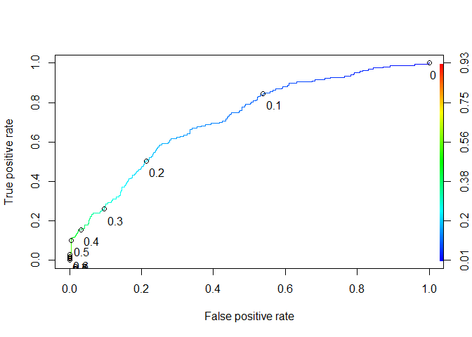

Logistic Regression
================
Aadil
01/10/2020

``` r
#Remove warnings
options(warn = -1)

#Remove environment varriables
rm(list = ls(all = TRUE))

#get and set working directoy
getwd()
```

    ## [1] "E:/ML"

``` r
setwd("E:/ML")
getwd()
```

    ## [1] "E:/ML"

``` r
#read the csv file
framingham = read.csv(file="framingham.csv")

#load required libraries
library(car)
```

    ## Loading required package: carData

``` r
library(caTools)
library(DAAG)
```

    ## Loading required package: lattice

    ## 
    ## Attaching package: 'DAAG'

    ## The following object is masked from 'package:car':
    ## 
    ##     vif

``` r
library(ROCR)

#Summary of date
summary(framingham)
```

    ##       male             age          education     currentSmoker   
    ##  Min.   :0.0000   Min.   :32.00   Min.   :1.000   Min.   :0.0000  
    ##  1st Qu.:0.0000   1st Qu.:42.00   1st Qu.:1.000   1st Qu.:0.0000  
    ##  Median :0.0000   Median :49.00   Median :2.000   Median :0.0000  
    ##  Mean   :0.4292   Mean   :49.58   Mean   :1.979   Mean   :0.4941  
    ##  3rd Qu.:1.0000   3rd Qu.:56.00   3rd Qu.:3.000   3rd Qu.:1.0000  
    ##  Max.   :1.0000   Max.   :70.00   Max.   :4.000   Max.   :1.0000  
    ##                                   NA's   :105                     
    ##    cigsPerDay         BPMeds        prevalentStroke     prevalentHyp   
    ##  Min.   : 0.000   Min.   :0.00000   Min.   :0.000000   Min.   :0.0000  
    ##  1st Qu.: 0.000   1st Qu.:0.00000   1st Qu.:0.000000   1st Qu.:0.0000  
    ##  Median : 0.000   Median :0.00000   Median :0.000000   Median :0.0000  
    ##  Mean   : 9.006   Mean   :0.02962   Mean   :0.005896   Mean   :0.3106  
    ##  3rd Qu.:20.000   3rd Qu.:0.00000   3rd Qu.:0.000000   3rd Qu.:1.0000  
    ##  Max.   :70.000   Max.   :1.00000   Max.   :1.000000   Max.   :1.0000  
    ##  NA's   :29       NA's   :53                                           
    ##     diabetes          totChol          sysBP           diaBP      
    ##  Min.   :0.00000   Min.   :107.0   Min.   : 83.5   Min.   : 48.0  
    ##  1st Qu.:0.00000   1st Qu.:206.0   1st Qu.:117.0   1st Qu.: 75.0  
    ##  Median :0.00000   Median :234.0   Median :128.0   Median : 82.0  
    ##  Mean   :0.02571   Mean   :236.7   Mean   :132.4   Mean   : 82.9  
    ##  3rd Qu.:0.00000   3rd Qu.:263.0   3rd Qu.:144.0   3rd Qu.: 90.0  
    ##  Max.   :1.00000   Max.   :696.0   Max.   :295.0   Max.   :142.5  
    ##                    NA's   :50                                     
    ##       BMI          heartRate         glucose         TenYearCHD    
    ##  Min.   :15.54   Min.   : 44.00   Min.   : 40.00   Min.   :0.0000  
    ##  1st Qu.:23.07   1st Qu.: 68.00   1st Qu.: 71.00   1st Qu.:0.0000  
    ##  Median :25.40   Median : 75.00   Median : 78.00   Median :0.0000  
    ##  Mean   :25.80   Mean   : 75.88   Mean   : 81.96   Mean   :0.1519  
    ##  3rd Qu.:28.04   3rd Qu.: 83.00   3rd Qu.: 87.00   3rd Qu.:0.0000  
    ##  Max.   :56.80   Max.   :143.00   Max.   :394.00   Max.   :1.0000  
    ##  NA's   :19      NA's   :1        NA's   :388

``` r
#Remove NA values
framingham <- na.omit(framingham)
#Split the data into train and test
set.seed(1000)
split = sample.split(framingham$TenYearCHD, SplitRatio = 0.70)
train = subset(framingham, split == TRUE)
test = subset(framingham, split == FALSE)

#Logistic regeression
framinghamLog = glm(TenYearCHD  ~ ., data = train, family = binomial)
summary(framinghamLog)
```

    ## 
    ## Call:
    ## glm(formula = TenYearCHD ~ ., family = binomial, data = train)
    ## 
    ## Deviance Residuals: 
    ##     Min       1Q   Median       3Q      Max  
    ## -1.9465  -0.6019  -0.4168  -0.2723   2.8342  
    ## 
    ## Coefficients:
    ##                  Estimate Std. Error z value Pr(>|z|)    
    ## (Intercept)     -8.147517   0.856122  -9.517  < 2e-16 ***
    ## male             0.562997   0.131368   4.286 1.82e-05 ***
    ## age              0.066380   0.007983   8.315  < 2e-16 ***
    ## education       -0.130789   0.060676  -2.156  0.03112 *  
    ## currentSmoker    0.031966   0.188375   0.170  0.86525    
    ## cigsPerDay       0.019760   0.007455   2.650  0.00804 ** 
    ## BPMeds           0.146584   0.283906   0.516  0.60564    
    ## prevalentStroke  0.633471   0.527053   1.202  0.22940    
    ## prevalentHyp     0.254990   0.166855   1.528  0.12646    
    ## diabetes         0.138585   0.368311   0.376  0.70671    
    ## totChol          0.003480   0.001325   2.626  0.00864 ** 
    ## sysBP            0.012884   0.004570   2.819  0.00482 ** 
    ## diaBP           -0.003368   0.007699  -0.437  0.66176    
    ## BMI             -0.001536   0.015467  -0.099  0.92089    
    ## heartRate       -0.003204   0.005094  -0.629  0.52945    
    ## glucose          0.007366   0.002807   2.624  0.00868 ** 
    ## ---
    ## Signif. codes:  0 '***' 0.001 '**' 0.01 '*' 0.05 '.' 0.1 ' ' 1
    ## 
    ## (Dispersion parameter for binomial family taken to be 1)
    ## 
    ##     Null deviance: 2185.3  on 2560  degrees of freedom
    ## Residual deviance: 1914.3  on 2545  degrees of freedom
    ## AIC: 1946.3
    ## 
    ## Number of Fisher Scoring iterations: 5

``` r
# check multicolinearity
car::vif(framinghamLog)
```

    ##            male             age       education   currentSmoker      cigsPerDay 
    ##        1.249028        1.267015        1.064799        2.588899        2.744778 
    ##          BPMeds prevalentStroke    prevalentHyp        diabetes         totChol 
    ##        1.106263        1.030437        2.015416        1.722506        1.070313 
    ##           sysBP           diaBP             BMI       heartRate         glucose 
    ##        3.521935        2.809076        1.235812        1.096363        1.732848

``` r
predictTrain = predict(framinghamLog, type = "response", newdata = train)
predictTrain
```

    ##          1          3          5          6          8         10         11 
    ## 0.03104483 0.16252783 0.09130990 0.10701415 0.07122273 0.23915464 0.08839836 
    ##         12         13         16         17         18         21         23 
    ## 0.04198725 0.19383556 0.05973530 0.15022513 0.08533273 0.05631661 0.14034765 
    ##         24         25         26         28         30         32         33 
    ## 0.09959213 0.21414120 0.09957943 0.08899710 0.14312806 0.10701255 0.19698977 
    ##         35         36         38         39         41         42         44 
    ## 0.31782243 0.05669979 0.45918543 0.08985915 0.05057005 0.03795138 0.15350258 
    ##         45         46         47         49         51         52         54 
    ## 0.56272587 0.05088234 0.35499620 0.21322603 0.31690800 0.08514338 0.19310517 
    ##         57         58         60         61         62         63         65 
    ## 0.10806454 0.20373990 0.05618708 0.20001825 0.34226651 0.19653411 0.18142091 
    ##         68         69         70         74         75         77         79 
    ## 0.07406196 0.09677178 0.07076144 0.08218739 0.04944983 0.06032603 0.06558335 
    ##         80         81         82         84         86         87         88 
    ## 0.22801840 0.45344649 0.10089772 0.09553380 0.02727583 0.19304873 0.41114474 
    ##         91         93         96         99        101        102        104 
    ## 0.21328357 0.06460335 0.14722438 0.34239302 0.08462840 0.21020747 0.10824296 
    ##        105        106        107        110        111        113        116 
    ## 0.05217409 0.17023002 0.03033248 0.13651009 0.31548462 0.08006167 0.21169488 
    ##        117        118        119        120        121        122        123 
    ## 0.39418678 0.02101725 0.02858006 0.28101424 0.02275392 0.05136305 0.24227511 
    ##        124        127        128        129        130        131        134 
    ## 0.07422460 0.09082882 0.04171318 0.08762182 0.03104695 0.19442274 0.16366828 
    ##        135        136        137        138        142        144        145 
    ## 0.06119398 0.20557061 0.05320845 0.22794949 0.12543853 0.22235544 0.21965520 
    ##        146        148        149        151        152        153        154 
    ## 0.13808852 0.08516882 0.18286915 0.22790541 0.16010701 0.21589800 0.47026450 
    ##        158        159        160        161        163        164        165 
    ## 0.15062002 0.13518793 0.02774433 0.02766061 0.03865071 0.15237533 0.14072983 
    ##        167        168        169        170        171        176        177 
    ## 0.03690422 0.03676956 0.12841763 0.09809838 0.09192169 0.47388644 0.28605171 
    ##        178        179        180        181        182        184        186 
    ## 0.17475099 0.03893651 0.04907556 0.03624208 0.07998042 0.12159109 0.13314259 
    ##        189        190        191        192        193        195        196 
    ## 0.08438897 0.12019548 0.10031055 0.27796001 0.26014073 0.07471641 0.05111779 
    ##        197        199        200        201        203        205        208 
    ## 0.13776602 0.20710968 0.25448038 0.02196309 0.13530579 0.03445775 0.13515763 
    ##        209        210        211        213        218        220        221 
    ## 0.21450783 0.10803115 0.07370894 0.44677880 0.18536482 0.03676187 0.03021080 
    ##        224        225        228        229        234        235        236 
    ## 0.02278487 0.07658332 0.32071899 0.09613758 0.06855118 0.23732281 0.01981458 
    ##        237        239        240        242        243        244        245 
    ## 0.34363880 0.10287616 0.10443385 0.49284547 0.04791390 0.04280800 0.33187858 
    ##        254        255        256        257        258        259        260 
    ## 0.23226848 0.12342788 0.49489799 0.06819952 0.18798821 0.03140656 0.44503644 
    ##        261        262        265        266        267        268        269 
    ## 0.19465273 0.17540671 0.22297732 0.06447550 0.20883041 0.13158430 0.06846709 
    ##        271        273        275        279        281        282        284 
    ## 0.13156621 0.20022896 0.06772036 0.03054182 0.10372890 0.15152393 0.01812127 
    ##        285        286        287        288        290        291        293 
    ## 0.47983059 0.07352084 0.02018742 0.05413494 0.05436770 0.06532840 0.11108824 
    ##        296        298        299        300        301        305        313 
    ## 0.15425027 0.01738695 0.05119943 0.23424124 0.07429310 0.04514272 0.09833330 
    ##        314        317        318        319        321        324        325 
    ## 0.13943958 0.33252075 0.12069003 0.14757767 0.10594029 0.05079677 0.06477432 
    ##        326        327        328        331        332        333        335 
    ## 0.13876433 0.05770022 0.44434061 0.04387668 0.05431042 0.15462510 0.14734776 
    ##        336        337        341        343        345        347        348 
    ## 0.05867873 0.21355806 0.17912804 0.03445472 0.29806583 0.13563100 0.10482134 
    ##        352        354        357        358        359        360        362 
    ## 0.09332755 0.08575567 0.18257985 0.17043753 0.03547797 0.37321963 0.02469382 
    ##        363        364        365        366        368        369        371 
    ## 0.04528655 0.07025250 0.23663906 0.05267491 0.22771032 0.15410827 0.03700166 
    ##        372        374        377        378        379        381        382 
    ## 0.19279363 0.04409216 0.06653591 0.27126115 0.29806277 0.07319658 0.05667939 
    ##        384        385        387        388        389        390        391 
    ## 0.15481076 0.11960995 0.30058181 0.12698737 0.02771221 0.04050960 0.32441894 
    ##        392        393        394        397        399        400        403 
    ## 0.09287800 0.06582022 0.23989383 0.04645229 0.40091960 0.44915207 0.04317801 
    ##        404        406        407        409        410        411        415 
    ## 0.03148112 0.10144002 0.05209663 0.07773245 0.18997169 0.03252681 0.34963268 
    ##        417        418        423        424        425        431        432 
    ## 0.15951943 0.08486015 0.04074308 0.13779208 0.03479495 0.02821116 0.08007699 
    ##        438        439        440        442        443        444        445 
    ## 0.17737551 0.06504596 0.20918664 0.15616550 0.05029467 0.20263269 0.10273998 
    ##        446        447        448        450        451        454        459 
    ## 0.23697270 0.44127661 0.13203801 0.06949652 0.06001420 0.06649766 0.12868487 
    ##        460        461        463        464        465        467        469 
    ## 0.03848553 0.05319171 0.13012401 0.12664830 0.23606079 0.12402732 0.03929759 
    ##        470        472        474        475        476        478        479 
    ## 0.11452345 0.60940642 0.15907526 0.15337076 0.21135946 0.06956940 0.04864055 
    ##        480        481        482        484        485        486        487 
    ## 0.20710829 0.15706753 0.64859156 0.03807386 0.14013306 0.32577388 0.02868600 
    ##        489        490        492        495        498        502        503 
    ## 0.07894240 0.05119825 0.19229061 0.29160440 0.21950999 0.11509135 0.19837130 
    ##        506        508        510        513        515        516        517 
    ## 0.03108168 0.09899034 0.06306980 0.27679294 0.31590135 0.18505514 0.24836731 
    ##        519        522        523        527        529        530        532 
    ## 0.07278825 0.06323927 0.45100190 0.05928506 0.11199047 0.15056814 0.31334127 
    ##        533        535        536        537        538        539        540 
    ## 0.02888008 0.06445719 0.06863065 0.08115371 0.26467583 0.17979916 0.04812669 
    ##        543        544        545        550        552        555        557 
    ## 0.05337094 0.34781655 0.01859972 0.16599803 0.19551661 0.15225554 0.06394693 
    ##        558        559        561        563        565        569        570 
    ## 0.20926698 0.06918151 0.02675543 0.03656969 0.05925137 0.01872766 0.06286560 
    ##        571        572        573        574        575        576        579 
    ## 0.05621809 0.15599315 0.05002624 0.19353204 0.08978630 0.15661427 0.07539709 
    ##        580        581        582        586        587        588        591 
    ## 0.39371722 0.12888761 0.22202335 0.32913813 0.13408846 0.09000046 0.49293990 
    ##        594        595        596        597        599        601        602 
    ## 0.05683009 0.03472439 0.06625706 0.05562022 0.04613777 0.06588718 0.09848880 
    ##        603        604        605        606        608        609        612 
    ## 0.11033782 0.30967495 0.64094248 0.29674798 0.17927038 0.11592481 0.01552607 
    ##        613        615        616        617        619        621        624 
    ## 0.02663669 0.15906440 0.11590450 0.03993275 0.27128315 0.31301478 0.07656770 
    ##        626        631        632        633        634        636        638 
    ## 0.02967727 0.30623635 0.07607363 0.05722656 0.15217927 0.29215342 0.02552035 
    ##        639        640        641        642        643        644        648 
    ## 0.17088830 0.19442025 0.10388332 0.07067052 0.02921322 0.11667394 0.04191475 
    ##        649        650        651        652        654        655        656 
    ## 0.05150390 0.17065064 0.18147040 0.15657543 0.36765508 0.04412031 0.07654781 
    ##        657        658        660        661        665        666        669 
    ## 0.19053192 0.11873879 0.20721181 0.25314968 0.48582298 0.17299464 0.03428738 
    ##        670        673        675        677        678        679        681 
    ## 0.12698766 0.11646902 0.07631326 0.05826205 0.31771781 0.28827059 0.12625396 
    ##        682        683        684        685        686        687        688 
    ## 0.28689812 0.14750201 0.33768491 0.06699524 0.07324801 0.09363865 0.04714796 
    ##        693        696        698        700        701        705        707 
    ## 0.22890451 0.11591472 0.07095791 0.43585387 0.13431175 0.33871697 0.12575923 
    ##        708        709        711        714        717        719        721 
    ## 0.11900895 0.06444013 0.14608032 0.10112293 0.19674861 0.19524799 0.04625083 
    ##        722        723        725        727        728        730        731 
    ## 0.66615550 0.31466353 0.29816877 0.29460350 0.05558330 0.03887719 0.02425559 
    ##        735        737        739        741        746        747        748 
    ## 0.21379388 0.12746416 0.19982516 0.34639464 0.32008883 0.17173676 0.22524435 
    ##        749        750        751        752        754        755        757 
    ## 0.11620606 0.05301996 0.44700737 0.14011577 0.17371912 0.17154255 0.06274119 
    ##        759        760        762        763        764        765        767 
    ## 0.13055409 0.25356906 0.02700175 0.06288207 0.59829130 0.05629847 0.42623847 
    ##        773        774        775        777        781        782        784 
    ## 0.08688610 0.06440377 0.07083275 0.01952678 0.05898979 0.06022339 0.14073026 
    ##        785        786        787        788        790        792        793 
    ## 0.05902368 0.12775886 0.10910870 0.13363149 0.40175080 0.22774609 0.15521120 
    ##        795        796        797        799        802        803        804 
    ## 0.06597391 0.38281042 0.16907444 0.09366782 0.04759682 0.11652712 0.04172468 
    ##        805        806        807        809        811        812        815 
    ## 0.11828640 0.09771058 0.12091381 0.06420308 0.11397293 0.24923466 0.06561928 
    ##        817        818        819        821        822        825        826 
    ## 0.11918954 0.11712838 0.04905620 0.04840756 0.24613582 0.02663333 0.13159834 
    ##        827        831        832        834        836        837        838 
    ## 0.10056844 0.02916730 0.09493055 0.29944927 0.20632625 0.06964122 0.24844348 
    ##        839        840        842        843        846        847        848 
    ## 0.21124411 0.10937422 0.14344012 0.03348900 0.09171464 0.19197351 0.03925756 
    ##        849        851        853        854        855        856        857 
    ## 0.14717732 0.12318526 0.03544698 0.12570378 0.05941563 0.08310005 0.11441896 
    ##        860        861        863        866        867        869        870 
    ## 0.28871230 0.02144260 0.36796007 0.11336199 0.15547983 0.04147431 0.07060011 
    ##        871        874        875        876        877        878        879 
    ## 0.11395433 0.30476265 0.10728896 0.11601743 0.10566463 0.29902824 0.30927898 
    ##        880        881        883        885        886        887        891 
    ## 0.08843817 0.16307367 0.25387351 0.09417201 0.44402405 0.31600516 0.36413877 
    ##        894        895        896        899        901        905        907 
    ## 0.05924977 0.07654269 0.16373871 0.32553834 0.07740108 0.08136162 0.14385052 
    ##        910        911        912        913        919        920        921 
    ## 0.27129110 0.05757226 0.01750886 0.23773948 0.11580681 0.03545938 0.21343376 
    ##        922        924        926        927        930        931        932 
    ## 0.08129243 0.17329159 0.05593879 0.53681223 0.10778972 0.03535650 0.14504037 
    ##        933        938        941        942        945        946        947 
    ## 0.41285352 0.07303595 0.17884765 0.23849533 0.19026480 0.03032359 0.07648136 
    ##        949        950        951        953        954        956        959 
    ## 0.53889186 0.03650568 0.05570173 0.69318974 0.03925696 0.39344009 0.06123156 
    ##        962        964        965        966        968        969        970 
    ## 0.08476594 0.04487301 0.05226218 0.23643203 0.14968232 0.14716213 0.24383522 
    ##        971        972        974        975        977        978        980 
    ## 0.18912355 0.02077275 0.04755689 0.16058629 0.56454079 0.04819940 0.22915383 
    ##        983        984        985        987        990        991        993 
    ## 0.16082068 0.07872734 0.05469382 0.07766389 0.19269165 0.05178986 0.23299492 
    ##        994        998       1001       1002       1004       1005       1007 
    ## 0.12893540 0.08915183 0.02459555 0.07813726 0.46257842 0.03777218 0.01997431 
    ##       1009       1011       1013       1014       1016       1017       1021 
    ## 0.35296000 0.11538631 0.11391294 0.09378746 0.34887447 0.26905873 0.05358315 
    ##       1022       1023       1025       1026       1031       1033       1034 
    ## 0.09030194 0.07074655 0.03769516 0.08323892 0.25416405 0.09802438 0.04492389 
    ##       1036       1038       1041       1042       1043       1044       1046 
    ## 0.02412711 0.11543968 0.30268200 0.34690408 0.17972185 0.26222288 0.37758764 
    ##       1048       1052       1053       1055       1056       1057       1058 
    ## 0.07869851 0.32671468 0.06847928 0.53539618 0.40432829 0.11049051 0.15148627 
    ##       1060       1066       1067       1068       1069       1070       1072 
    ## 0.02527189 0.11331672 0.07256015 0.09411748 0.46663328 0.11981504 0.20237020 
    ##       1074       1078       1081       1082       1084       1085       1087 
    ## 0.12260998 0.10705757 0.33319375 0.17712697 0.09957623 0.06940061 0.05104476 
    ##       1088       1090       1091       1092       1093       1094       1096 
    ## 0.03571942 0.04394722 0.03608907 0.15944438 0.14899016 0.11523949 0.18302504 
    ##       1097       1099       1100       1101       1103       1104       1108 
    ## 0.08606020 0.07592969 0.03610095 0.05644304 0.08808943 0.30554123 0.04796712 
    ##       1109       1110       1112       1113       1115       1118       1121 
    ## 0.26232196 0.03939903 0.50019674 0.16212655 0.22977151 0.26511664 0.09205815 
    ##       1122       1125       1126       1127       1128       1129       1131 
    ## 0.14524175 0.05358119 0.09918663 0.11945956 0.03343565 0.34211525 0.22626023 
    ##       1132       1134       1136       1137       1138       1140       1142 
    ## 0.19290858 0.24520000 0.15822626 0.08906768 0.07016829 0.18478145 0.26768422 
    ##       1145       1147       1148       1149       1150       1151       1152 
    ## 0.22649512 0.32384758 0.25062014 0.08663141 0.07789427 0.09973542 0.03252310 
    ##       1154       1155       1157       1158       1159       1160       1161 
    ## 0.38998061 0.09475743 0.10307043 0.03532257 0.05205872 0.13355667 0.03792397 
    ##       1163       1164       1165       1166       1167       1168       1169 
    ## 0.16738383 0.37632667 0.03605352 0.23029091 0.26655227 0.06745906 0.09424084 
    ##       1170       1171       1172       1174       1175       1179       1181 
    ## 0.13474261 0.47338863 0.18623358 0.02015786 0.29687309 0.11798352 0.05641224 
    ##       1183       1184       1185       1186       1187       1188       1189 
    ## 0.11167779 0.19914672 0.22855638 0.08356527 0.17442384 0.16921999 0.37966197 
    ##       1192       1193       1194       1196       1197       1199       1200 
    ## 0.49590234 0.06394646 0.20914234 0.45000546 0.22663772 0.02354777 0.10570232 
    ##       1201       1202       1204       1208       1209       1213       1216 
    ## 0.33530047 0.09070038 0.60615014 0.02109386 0.04540538 0.14428332 0.15450091 
    ##       1217       1218       1219       1221       1222       1223       1224 
    ## 0.03021399 0.04985629 0.04850642 0.03339314 0.18416679 0.02156855 0.03564765 
    ##       1226       1227       1229       1230       1231       1232       1234 
    ## 0.05049872 0.02090433 0.04126575 0.04279466 0.56452413 0.05414585 0.18059323 
    ##       1236       1237       1239       1241       1242       1243       1245 
    ## 0.22825592 0.29806339 0.07724176 0.08667755 0.24174283 0.08419643 0.04851747 
    ##       1247       1248       1249       1250       1252       1253       1255 
    ## 0.07810443 0.03314618 0.17661874 0.11155424 0.14159178 0.06044263 0.09974536 
    ##       1256       1258       1261       1262       1263       1264       1266 
    ## 0.17054198 0.30992250 0.23980432 0.05830488 0.10575817 0.08460341 0.20901084 
    ##       1267       1268       1269       1274       1275       1278       1280 
    ## 0.22222471 0.03952987 0.58109305 0.10842060 0.06399608 0.11809420 0.30958917 
    ##       1282       1286       1288       1290       1291       1292       1294 
    ## 0.02628514 0.02943657 0.03936806 0.16778119 0.02964175 0.06884905 0.08245649 
    ##       1295       1297       1299       1301       1303       1304       1305 
    ## 0.12971770 0.12404649 0.13231457 0.13121242 0.29211452 0.30290650 0.20061714 
    ##       1306       1307       1308       1310       1312       1313       1314 
    ## 0.22337117 0.10748242 0.09659577 0.02011367 0.23934925 0.18471249 0.01522020 
    ##       1316       1317       1319       1320       1321       1322       1323 
    ## 0.15388268 0.11321321 0.21235813 0.01946883 0.11272812 0.19184769 0.19389243 
    ##       1324       1325       1327       1329       1332       1333       1334 
    ## 0.16477268 0.27112934 0.07057763 0.15534018 0.05751315 0.02911405 0.27041889 
    ##       1337       1339       1340       1341       1342       1343       1344 
    ## 0.03727628 0.05941361 0.15944847 0.10359507 0.24868068 0.27422729 0.04050201 
    ##       1345       1346       1347       1349       1350       1352       1353 
    ## 0.09052733 0.05633949 0.05776336 0.04159781 0.36487442 0.10424564 0.09933202 
    ##       1354       1356       1358       1359       1361       1365       1366 
    ## 0.04879562 0.04902482 0.50509233 0.21805918 0.24282720 0.06779822 0.13451387 
    ##       1368       1370       1373       1374       1379       1380       1382 
    ## 0.13152689 0.03074510 0.25467501 0.34566960 0.18690364 0.21524139 0.47087606 
    ##       1383       1384       1386       1387       1388       1389       1390 
    ## 0.06168475 0.05000718 0.06198078 0.10083526 0.12763483 0.05985784 0.16976775 
    ##       1391       1392       1393       1394       1397       1398       1399 
    ## 0.40654470 0.09806440 0.05371662 0.08321144 0.10682353 0.07647142 0.03908580 
    ##       1400       1402       1404       1406       1407       1408       1410 
    ## 0.48491725 0.02730428 0.06369919 0.06850514 0.03717484 0.02968224 0.17515482 
    ##       1416       1418       1419       1420       1421       1423       1426 
    ## 0.17100176 0.08933723 0.14655883 0.06816228 0.02263404 0.08850883 0.06459016 
    ##       1427       1428       1429       1431       1432       1433       1434 
    ## 0.11466630 0.11275124 0.14199730 0.19264752 0.06484058 0.07631463 0.11709799 
    ##       1435       1436       1440       1441       1442       1443       1444 
    ## 0.12529171 0.23821679 0.10412858 0.05697904 0.05104593 0.46621803 0.15450867 
    ##       1445       1447       1448       1450       1453       1454       1455 
    ## 0.04439683 0.22980755 0.20253437 0.12568591 0.16976460 0.15508767 0.18587475 
    ##       1456       1457       1458       1459       1460       1461       1464 
    ## 0.08958687 0.27851432 0.18263735 0.17063518 0.02355755 0.21534299 0.34318225 
    ##       1468       1469       1470       1472       1473       1474       1475 
    ## 0.07164761 0.49510428 0.14459361 0.05219004 0.26666466 0.05755668 0.09213729 
    ##       1476       1478       1480       1481       1487       1489       1491 
    ## 0.05423074 0.08059646 0.06252590 0.01991824 0.21107188 0.12380955 0.33601374 
    ##       1492       1493       1495       1496       1500       1501       1502 
    ## 0.12906681 0.14542438 0.11754744 0.04871345 0.04151679 0.17179155 0.07581320 
    ##       1503       1504       1505       1506       1508       1509       1510 
    ## 0.26101028 0.24503321 0.06305260 0.06216459 0.18773352 0.08712007 0.04829528 
    ##       1512       1513       1514       1515       1516       1517       1518 
    ## 0.03219230 0.19868686 0.04847294 0.24989058 0.16096026 0.03460883 0.09033407 
    ##       1520       1521       1523       1527       1528       1529       1530 
    ## 0.21331852 0.27375387 0.16696605 0.03670429 0.27131052 0.09699703 0.04748306 
    ##       1531       1533       1535       1536       1537       1539       1540 
    ## 0.05302958 0.16685231 0.16899576 0.08804717 0.06171658 0.02756276 0.16663822 
    ##       1542       1545       1548       1549       1550       1553       1554 
    ## 0.09371196 0.17243029 0.02787398 0.13127971 0.08233758 0.06010813 0.71726990 
    ##       1555       1557       1559       1561       1562       1563       1564 
    ## 0.16508593 0.03038492 0.29581719 0.18742021 0.40579793 0.01792699 0.20167144 
    ##       1565       1566       1568       1571       1572       1578       1580 
    ## 0.11584265 0.13340270 0.38417089 0.04074942 0.10003786 0.07836601 0.23751767 
    ##       1584       1585       1588       1589       1591       1593       1594 
    ## 0.07777488 0.06989215 0.02439654 0.56405285 0.12737177 0.12257505 0.02495297 
    ##       1598       1599       1600       1601       1602       1606       1609 
    ## 0.02419969 0.24755996 0.03821668 0.38093163 0.24245441 0.04940319 0.11125892 
    ##       1610       1612       1613       1614       1615       1619       1620 
    ## 0.18793485 0.04716522 0.04377692 0.14156084 0.33406080 0.11129508 0.30166448 
    ##       1621       1622       1624       1628       1629       1631       1632 
    ## 0.30827323 0.05542965 0.11147824 0.05243073 0.07439217 0.16122438 0.21682549 
    ##       1633       1634       1635       1637       1638       1639       1640 
    ## 0.21388360 0.03100751 0.07390567 0.06325089 0.02353521 0.16050034 0.20942969 
    ##       1643       1644       1647       1649       1650       1651       1652 
    ## 0.05567003 0.03113675 0.14636672 0.12012457 0.30761015 0.11588053 0.07784004 
    ##       1653       1657       1658       1660       1661       1664       1665 
    ## 0.02342088 0.03503724 0.07406089 0.06740078 0.32379618 0.33896144 0.07712955 
    ##       1666       1667       1668       1670       1673       1674       1675 
    ## 0.20979521 0.05515603 0.20413692 0.08863723 0.19138574 0.08159484 0.43145876 
    ##       1677       1678       1679       1681       1684       1686       1687 
    ## 0.13069851 0.05548905 0.35048329 0.24133567 0.02966119 0.06066524 0.05448069 
    ##       1689       1692       1694       1696       1697       1698       1700 
    ## 0.02404266 0.42861253 0.04302515 0.17629412 0.07932428 0.11322833 0.12030306 
    ##       1703       1704       1705       1708       1710       1711       1712 
    ## 0.05332346 0.10954771 0.19500307 0.05451688 0.09262033 0.20082942 0.09376223 
    ##       1714       1715       1718       1719       1723       1725       1726 
    ## 0.19379806 0.10128859 0.49501882 0.06045220 0.34338048 0.04872662 0.14136680 
    ##       1728       1730       1732       1733       1734       1735       1736 
    ## 0.18768852 0.41904906 0.29201779 0.07958320 0.02559357 0.03027642 0.16276872 
    ##       1737       1738       1740       1741       1742       1743       1744 
    ## 0.08683573 0.04198183 0.17753522 0.08090916 0.30266370 0.06591018 0.18332460 
    ##       1747       1749       1750       1751       1753       1754       1755 
    ## 0.03129295 0.20928520 0.19963641 0.03851373 0.40812671 0.04250855 0.02318744 
    ##       1756       1757       1758       1760       1763       1764       1765 
    ## 0.06333892 0.05011973 0.03897442 0.41621387 0.07716454 0.15262148 0.20879902 
    ##       1766       1768       1770       1772       1775       1777       1778 
    ## 0.36312929 0.09836918 0.10641025 0.21313657 0.17509886 0.05286218 0.05499931 
    ##       1781       1782       1784       1785       1788       1789       1791 
    ## 0.06733341 0.07379846 0.23206938 0.08122481 0.07073997 0.17733131 0.29801869 
    ##       1795       1796       1797       1799       1800       1803       1804 
    ## 0.11624288 0.16898124 0.26223781 0.23673976 0.12813047 0.05979441 0.21727651 
    ##       1807       1812       1813       1815       1817       1820       1821 
    ## 0.03807867 0.11372089 0.31099917 0.02851790 0.20153566 0.03937227 0.19646606 
    ##       1824       1825       1826       1827       1828       1829       1830 
    ## 0.19740703 0.20000442 0.14244494 0.01809329 0.05618127 0.34348548 0.05491026 
    ##       1832       1833       1835       1836       1837       1838       1839 
    ## 0.05475546 0.25646141 0.10053737 0.03545889 0.17373530 0.27010492 0.21282999 
    ##       1841       1842       1843       1844       1847       1849       1850 
    ## 0.11596685 0.04808194 0.39734596 0.18698428 0.05683664 0.07279683 0.26220596 
    ##       1851       1852       1854       1855       1856       1857       1859 
    ## 0.06939486 0.04230384 0.03119255 0.50164839 0.31430377 0.21180998 0.21827661 
    ##       1860       1863       1864       1865       1868       1872       1873 
    ## 0.38763826 0.07370219 0.10190941 0.13099723 0.14665071 0.14933439 0.02468430 
    ##       1874       1875       1876       1877       1878       1879       1882 
    ## 0.24040876 0.20806835 0.05233844 0.04310779 0.15787405 0.46821720 0.12847096 
    ##       1883       1885       1887       1888       1889       1890       1891 
    ## 0.03240245 0.13479029 0.17483454 0.04795731 0.52359656 0.24040417 0.08364712 
    ##       1896       1901       1903       1904       1905       1907       1908 
    ## 0.17791635 0.02989330 0.24553095 0.05176246 0.29583975 0.08489333 0.19061198 
    ##       1909       1912       1913       1915       1917       1919       1921 
    ## 0.04842414 0.05185391 0.06102280 0.29329076 0.07865281 0.14329657 0.22890507 
    ##       1923       1924       1926       1928       1929       1930       1931 
    ## 0.26830165 0.06479740 0.20531343 0.07936282 0.04306045 0.05173864 0.26778825 
    ##       1932       1934       1937       1939       1940       1942       1943 
    ## 0.48981225 0.12602298 0.08002168 0.07081859 0.38062378 0.04037015 0.27553845 
    ##       1944       1945       1946       1949       1950       1951       1953 
    ## 0.08041441 0.04394732 0.12044373 0.09931737 0.08477071 0.14950098 0.15777671 
    ##       1954       1955       1957       1960       1961       1962       1965 
    ## 0.08085585 0.06005604 0.31810906 0.07208618 0.13121883 0.03781287 0.04134680 
    ##       1969       1971       1973       1974       1977       1978       1982 
    ## 0.07151735 0.04869566 0.16348097 0.09449431 0.14948893 0.14852008 0.19005454 
    ##       1983       1989       1993       1994       1995       1996       1997 
    ## 0.01667474 0.04562874 0.03992872 0.06756320 0.15792689 0.11615165 0.05948917 
    ##       2000       2001       2002       2005       2006       2008       2010 
    ## 0.03531703 0.05077347 0.15164254 0.04155732 0.07683315 0.64749307 0.10581002 
    ##       2013       2014       2016       2018       2019       2020       2024 
    ## 0.13607692 0.12292856 0.01652892 0.09578611 0.17614027 0.05027224 0.25398124 
    ##       2025       2026       2028       2029       2030       2031       2032 
    ## 0.43143925 0.21764036 0.03461786 0.06011546 0.05219412 0.41801031 0.22210394 
    ##       2033       2036       2037       2038       2040       2043       2048 
    ## 0.02199413 0.05176184 0.31768576 0.02227172 0.06364581 0.13559043 0.07523478 
    ##       2051       2052       2053       2054       2056       2057       2058 
    ## 0.20578078 0.07096661 0.09829024 0.07714826 0.09314032 0.12960478 0.11913002 
    ##       2059       2060       2062       2063       2064       2066       2067 
    ## 0.32496295 0.05448011 0.27614283 0.23148344 0.08979405 0.35444279 0.08430359 
    ##       2070       2072       2073       2074       2076       2077       2078 
    ## 0.07230843 0.09655854 0.28083264 0.03747607 0.03877751 0.27340181 0.17892791 
    ##       2079       2081       2083       2084       2085       2087       2091 
    ## 0.02556549 0.15301098 0.06749405 0.28041898 0.08089144 0.14877361 0.03471904 
    ##       2096       2099       2103       2112       2113       2114       2115 
    ## 0.31046541 0.02781206 0.02992940 0.20833850 0.19339514 0.09369786 0.34505423 
    ##       2116       2117       2122       2124       2125       2126       2127 
    ## 0.26738548 0.02299504 0.03047967 0.16788049 0.24174900 0.26326119 0.16760038 
    ##       2129       2130       2131       2133       2134       2136       2137 
    ## 0.17490596 0.26054959 0.18946306 0.30401960 0.28769917 0.03017213 0.25149705 
    ##       2138       2140       2141       2144       2147       2148       2149 
    ## 0.03645389 0.02412315 0.11565565 0.10303629 0.07314184 0.12367424 0.12574964 
    ##       2151       2153       2155       2156       2157       2159       2160 
    ## 0.10518697 0.02774109 0.02846699 0.06255198 0.03676426 0.08935513 0.04832535 
    ##       2163       2164       2165       2166       2167       2168       2170 
    ## 0.47138778 0.13302571 0.10819732 0.05110752 0.04043135 0.07667632 0.13682387 
    ##       2171       2172       2176       2177       2179       2180       2181 
    ## 0.12465003 0.12418522 0.21793280 0.07974527 0.04718148 0.36298229 0.27417894 
    ##       2186       2187       2192       2193       2194       2195       2198 
    ## 0.06058958 0.19428148 0.10398310 0.10086239 0.14477910 0.17088437 0.43591984 
    ##       2201       2202       2203       2204       2205       2207       2208 
    ## 0.08335815 0.10264144 0.02465674 0.06458559 0.46827510 0.42174370 0.02167065 
    ##       2209       2212       2213       2214       2215       2216       2219 
    ## 0.06437091 0.08220604 0.19415548 0.46394522 0.15059654 0.33265179 0.09961084 
    ##       2221       2222       2223       2224       2226       2228       2230 
    ## 0.09333520 0.40133467 0.30631010 0.05843815 0.03378345 0.18435646 0.04876806 
    ##       2231       2232       2233       2234       2236       2237       2238 
    ## 0.06422347 0.09240047 0.05364112 0.05511682 0.26332603 0.09133271 0.11573090 
    ##       2239       2240       2241       2243       2244       2245       2246 
    ## 0.37735320 0.06891485 0.09422688 0.10974101 0.08478855 0.02244781 0.10172770 
    ##       2247       2248       2249       2252       2253       2254       2256 
    ## 0.20537315 0.19324242 0.02135832 0.03538990 0.09666308 0.28492984 0.05133270 
    ##       2258       2259       2262       2265       2272       2273       2277 
    ## 0.16195942 0.12983208 0.15721040 0.10702685 0.31936377 0.06567837 0.05234978 
    ##       2279       2280       2281       2282       2283       2284       2285 
    ## 0.43487660 0.15115983 0.11495223 0.06389265 0.15845076 0.06063660 0.12329300 
    ##       2287       2289       2291       2293       2295       2296       2297 
    ## 0.03593570 0.06668194 0.19221843 0.16171872 0.04549112 0.16904070 0.08495493 
    ##       2298       2299       2301       2303       2305       2306       2307 
    ## 0.14829085 0.54168007 0.02724794 0.04727223 0.49703318 0.40267275 0.11531404 
    ##       2312       2317       2319       2321       2323       2324       2326 
    ## 0.06173099 0.11613509 0.23868934 0.07455714 0.47701732 0.06413871 0.19932630 
    ##       2327       2328       2329       2330       2331       2332       2336 
    ## 0.08219271 0.17821665 0.44089637 0.08582338 0.04414734 0.10293137 0.25650501 
    ##       2337       2340       2343       2344       2345       2346       2348 
    ## 0.07091056 0.10076475 0.02667636 0.03550855 0.04828567 0.31179447 0.02778355 
    ##       2349       2351       2354       2355       2357       2358       2361 
    ## 0.19363063 0.06375883 0.08240483 0.10045489 0.18862100 0.03899874 0.08260155 
    ##       2362       2364       2365       2366       2369       2370       2372 
    ## 0.07280171 0.08994452 0.15946620 0.02728148 0.22709766 0.09910376 0.24137096 
    ##       2373       2375       2377       2378       2379       2380       2381 
    ## 0.04327487 0.14457720 0.24138191 0.09644514 0.58572088 0.05054259 0.28688418 
    ##       2384       2385       2386       2388       2389       2390       2391 
    ## 0.11930798 0.09956085 0.14330014 0.03384716 0.04412852 0.08789849 0.08119537 
    ##       2392       2393       2395       2397       2398       2400       2401 
    ## 0.13715467 0.18344267 0.09427139 0.03230700 0.04988015 0.07675464 0.01484539 
    ##       2402       2408       2409       2411       2413       2417       2419 
    ## 0.02234812 0.11797983 0.08562999 0.06803389 0.11442296 0.53160069 0.11447185 
    ##       2420       2421       2422       2423       2424       2426       2427 
    ## 0.11206167 0.17227790 0.21887927 0.01544956 0.13066473 0.14418833 0.20293472 
    ##       2428       2429       2430       2434       2437       2439       2440 
    ## 0.06255163 0.04148948 0.11552251 0.11326724 0.10503175 0.15202283 0.04603524 
    ##       2441       2442       2443       2444       2445       2446       2448 
    ## 0.12155646 0.27867006 0.06444075 0.29115729 0.09642836 0.07326159 0.40579163 
    ##       2449       2451       2452       2453       2455       2458       2459 
    ## 0.17234968 0.08341566 0.27279105 0.08662006 0.05729098 0.19921756 0.24062373 
    ##       2460       2461       2462       2464       2465       2466       2467 
    ## 0.21687535 0.25087486 0.53652529 0.25718602 0.04628722 0.05130890 0.42926522 
    ##       2468       2470       2471       2473       2474       2478       2479 
    ## 0.40763601 0.15927730 0.04977493 0.18099152 0.36451647 0.08813094 0.26463042 
    ##       2481       2482       2483       2484       2486       2487       2489 
    ## 0.07395362 0.03889606 0.09512633 0.07312962 0.12971817 0.36004375 0.50988744 
    ##       2490       2493       2494       2496       2497       2498       2500 
    ## 0.05192959 0.38086990 0.15032846 0.06284165 0.15295453 0.30875946 0.05634445 
    ##       2501       2502       2503       2504       2505       2507       2509 
    ## 0.16020357 0.33400328 0.18021045 0.35655582 0.04946880 0.07992731 0.16980662 
    ##       2510       2511       2512       2513       2515       2516       2517 
    ## 0.04500496 0.11463629 0.03786715 0.08804057 0.02271852 0.19946421 0.03345319 
    ##       2520       2521       2522       2523       2527       2528       2529 
    ## 0.06149744 0.09418929 0.20663577 0.02671122 0.02885809 0.08316415 0.39843759 
    ##       2532       2533       2534       2535       2536       2537       2538 
    ## 0.03060777 0.09823810 0.09914145 0.18699460 0.21157006 0.09392107 0.09254383 
    ##       2540       2541       2542       2545       2547       2548       2551 
    ## 0.09481567 0.15147474 0.12269052 0.01964556 0.02713120 0.25172818 0.09978398 
    ##       2553       2554       2558       2559       2561       2562       2563 
    ## 0.08226868 0.02732328 0.19722912 0.04022169 0.09178731 0.04659546 0.03518098 
    ##       2566       2572       2573       2576       2578       2579       2580 
    ## 0.13691731 0.02991594 0.33334246 0.17874320 0.13363387 0.17000925 0.10655438 
    ##       2582       2583       2588       2589       2591       2592       2593 
    ## 0.24072313 0.02503678 0.08593780 0.12744796 0.07302878 0.04795016 0.02283197 
    ##       2595       2597       2599       2601       2602       2605       2608 
    ## 0.05591600 0.03399609 0.09277853 0.57915839 0.24052788 0.04455454 0.24290081 
    ##       2611       2614       2615       2618       2619       2620       2621 
    ## 0.10063318 0.11329569 0.14662619 0.22361514 0.04343628 0.04134137 0.46126542 
    ##       2622       2624       2625       2626       2628       2629       2630 
    ## 0.13484573 0.05194165 0.07828595 0.22832498 0.07191229 0.18819096 0.08029821 
    ##       2633       2634       2635       2637       2638       2643       2647 
    ## 0.09420701 0.03431708 0.48413027 0.03501000 0.25640464 0.25555510 0.31144613 
    ##       2648       2650       2652       2653       2654       2657       2658 
    ## 0.03486448 0.36509368 0.11690147 0.15220876 0.09673972 0.09862228 0.20092743 
    ##       2660       2662       2664       2666       2667       2668       2669 
    ## 0.13725105 0.20910208 0.03368615 0.17505943 0.03415966 0.24959003 0.34102629 
    ##       2671       2673       2674       2675       2676       2677       2683 
    ## 0.31288139 0.27083745 0.07439376 0.42494155 0.07846406 0.12049612 0.26445811 
    ##       2685       2686       2687       2688       2689       2691       2692 
    ## 0.10223844 0.09905366 0.54657137 0.28448212 0.09975225 0.16141348 0.19589011 
    ##       2698       2699       2701       2702       2703       2705       2706 
    ## 0.19311251 0.36197984 0.15647776 0.08007729 0.14529136 0.07109227 0.19643026 
    ##       2707       2708       2710       2715       2716       2717       2718 
    ## 0.31757994 0.02288488 0.29851820 0.10124376 0.07050699 0.27118279 0.18563964 
    ##       2719       2721       2722       2723       2724       2725       2726 
    ## 0.65758919 0.03683634 0.08131012 0.18714926 0.09228121 0.16593765 0.05138065 
    ##       2727       2730       2731       2732       2733       2734       2736 
    ## 0.03136081 0.18941500 0.06749347 0.37391116 0.06833424 0.24804784 0.12342671 
    ##       2738       2740       2742       2743       2744       2746       2747 
    ## 0.12351896 0.05064226 0.02599657 0.10696313 0.04113740 0.38369448 0.04334118 
    ##       2748       2750       2751       2754       2755       2758       2759 
    ## 0.17153614 0.20876427 0.08095448 0.04802638 0.04895164 0.31853048 0.10171374 
    ##       2760       2761       2762       2766       2767       2768       2769 
    ## 0.03486191 0.04995834 0.02353938 0.03882639 0.26154376 0.19695675 0.04124100 
    ##       2773       2775       2776       2777       2778       2779       2781 
    ## 0.03718479 0.07884959 0.15882166 0.16781804 0.03486395 0.09458945 0.10123933 
    ##       2782       2783       2784       2788       2789       2790       2791 
    ## 0.15684260 0.28033530 0.11694529 0.10347614 0.13584615 0.29343775 0.15388255 
    ##       2794       2795       2796       2799       2800       2803       2804 
    ## 0.27718557 0.15057794 0.20573697 0.14260521 0.22896807 0.33538308 0.33404756 
    ##       2807       2808       2810       2811       2812       2814       2816 
    ## 0.25576615 0.10467811 0.06299026 0.07438764 0.03323245 0.11890590 0.10531671 
    ##       2817       2818       2820       2822       2824       2827       2828 
    ## 0.04371565 0.09315302 0.41977424 0.13623104 0.13980625 0.03639503 0.18698463 
    ##       2829       2831       2832       2833       2834       2835       2837 
    ## 0.13671567 0.02436792 0.07004595 0.09244820 0.02838420 0.19128672 0.43735816 
    ##       2839       2840       2841       2842       2843       2844       2845 
    ## 0.28223257 0.19187954 0.15904408 0.23435955 0.06741452 0.08707865 0.06951825 
    ##       2846       2849       2851       2854       2855       2856       2857 
    ## 0.09951017 0.08499137 0.19927170 0.09813599 0.30390216 0.37669009 0.40338051 
    ##       2858       2860       2861       2862       2863       2864       2865 
    ## 0.02358929 0.25691308 0.04088579 0.07318396 0.17040718 0.03617771 0.34226360 
    ##       2866       2867       2868       2870       2871       2872       2874 
    ## 0.09635152 0.11184382 0.06159065 0.05835018 0.76570190 0.07905358 0.16737312 
    ##       2877       2878       2884       2887       2888       2890       2891 
    ## 0.08009664 0.30140953 0.30403183 0.05865530 0.06338712 0.03181784 0.05557151 
    ##       2894       2895       2897       2898       2901       2904       2907 
    ## 0.76811301 0.02433967 0.05279222 0.06788765 0.02114182 0.13006219 0.12437863 
    ##       2908       2913       2914       2915       2916       2917       2919 
    ## 0.19961808 0.03881075 0.02884417 0.04696726 0.09007748 0.05489903 0.06327089 
    ##       2920       2921       2922       2923       2924       2925       2927 
    ## 0.14329463 0.25577942 0.41420678 0.16977291 0.11653574 0.05500833 0.12787594 
    ##       2932       2934       2936       2937       2939       2940       2948 
    ## 0.07950434 0.21787085 0.26667599 0.34253694 0.25835317 0.03504494 0.14682628 
    ##       2949       2951       2952       2953       2954       2955       2956 
    ## 0.13620589 0.03806552 0.11266615 0.26678172 0.15766752 0.16235190 0.04500826 
    ##       2958       2960       2961       2962       2964       2965       2966 
    ## 0.06154809 0.16772657 0.27838489 0.65032164 0.05952300 0.42449824 0.08848996 
    ##       2970       2971       2973       2974       2975       2978       2980 
    ## 0.13675488 0.05782318 0.16059590 0.24884805 0.26870571 0.25435246 0.09132199 
    ##       2982       2984       2986       2990       2991       2992       2996 
    ## 0.32457797 0.40022003 0.33042972 0.02383906 0.24109951 0.07660930 0.19011801 
    ##       2999       3000       3003       3004       3005       3006       3007 
    ## 0.10603910 0.11921321 0.32074264 0.20349013 0.17018399 0.19447980 0.02491033 
    ##       3010       3011       3012       3014       3015       3016       3017 
    ## 0.14853932 0.04673493 0.09562940 0.04003866 0.17252193 0.01866518 0.02179629 
    ##       3018       3019       3021       3023       3024       3025       3027 
    ## 0.07389523 0.16131220 0.09308151 0.13794903 0.10056034 0.08941620 0.44739830 
    ##       3028       3029       3030       3031       3032       3033       3036 
    ## 0.06943881 0.06998473 0.08937795 0.03674559 0.27055402 0.11674577 0.08863011 
    ##       3037       3038       3039       3040       3042       3043       3045 
    ## 0.01788774 0.04875983 0.07017231 0.04923661 0.24621396 0.02124702 0.05072411 
    ##       3048       3050       3051       3053       3054       3055       3057 
    ## 0.27634232 0.16570750 0.21441404 0.19900071 0.09217154 0.42480609 0.06697115 
    ##       3058       3059       3060       3061       3062       3064       3065 
    ## 0.43432366 0.11964771 0.09492989 0.08987843 0.18243404 0.09254142 0.02929616 
    ##       3066       3067       3069       3070       3074       3076       3077 
    ## 0.17833545 0.17016972 0.06418993 0.40243185 0.09316613 0.03884131 0.07230586 
    ##       3078       3079       3080       3081       3082       3083       3084 
    ## 0.14961968 0.04622614 0.13779310 0.32277875 0.03514350 0.11613131 0.10808750 
    ##       3085       3086       3087       3089       3093       3094       3096 
    ## 0.05562788 0.21370959 0.30095650 0.40810062 0.19338760 0.05754830 0.08098144 
    ##       3097       3098       3103       3104       3105       3110       3116 
    ## 0.39579000 0.10988977 0.39293781 0.07567261 0.04499424 0.04160630 0.09874836 
    ##       3117       3118       3120       3126       3127       3128       3129 
    ## 0.04904406 0.22162727 0.14001030 0.05129817 0.12313065 0.03941991 0.11977599 
    ##       3131       3132       3133       3134       3135       3137       3138 
    ## 0.14182915 0.30803380 0.24873868 0.18429362 0.27540094 0.49926137 0.34775492 
    ##       3139       3141       3142       3146       3152       3153       3155 
    ## 0.09683700 0.07117248 0.03495675 0.07186522 0.15378737 0.02353927 0.05989566 
    ##       3160       3162       3165       3166       3167       3168       3169 
    ## 0.06828014 0.24486561 0.16601703 0.19460664 0.09373491 0.37275832 0.10892347 
    ##       3173       3174       3175       3179       3180       3181       3183 
    ## 0.20725491 0.01990445 0.08171805 0.05932718 0.08859003 0.14110383 0.18190103 
    ##       3185       3187       3188       3189       3190       3193       3194 
    ## 0.03475961 0.06963760 0.19502260 0.34247758 0.04854787 0.02563456 0.03460935 
    ##       3195       3196       3197       3201       3203       3204       3205 
    ## 0.03200169 0.18119563 0.07041851 0.13213824 0.07866499 0.10807438 0.08938922 
    ##       3206       3209       3210       3211       3212       3213       3214 
    ## 0.08331929 0.02783639 0.09677983 0.15559120 0.12554611 0.16210641 0.24063672 
    ##       3215       3217       3218       3219       3221       3224       3225 
    ## 0.20838451 0.07516888 0.03569434 0.05714404 0.29244770 0.10159431 0.04065877 
    ##       3228       3229       3231       3232       3233       3234       3236 
    ## 0.08304488 0.04497218 0.17979858 0.13266213 0.03625247 0.43097860 0.05472570 
    ##       3237       3239       3241       3242       3243       3244       3245 
    ## 0.03730515 0.13545255 0.07695095 0.07382146 0.29767706 0.12008554 0.30039178 
    ##       3246       3247       3248       3249       3251       3253       3254 
    ## 0.30546927 0.09154601 0.23742952 0.06037807 0.11863236 0.09060076 0.04688595 
    ##       3255       3256       3257       3258       3260       3262       3263 
    ## 0.20425138 0.48372399 0.10393265 0.21503410 0.01530833 0.21282146 0.22296558 
    ##       3264       3268       3270       3271       3273       3275       3276 
    ## 0.06728050 0.20232845 0.04712932 0.14645654 0.03793881 0.19882577 0.02213847 
    ##       3278       3279       3282       3283       3284       3285       3287 
    ## 0.03678287 0.47849437 0.11264958 0.06843797 0.19256725 0.03369792 0.26536290 
    ##       3288       3289       3290       3293       3300       3302       3303 
    ## 0.06003112 0.11122967 0.23229402 0.03436728 0.08662616 0.03496786 0.33269585 
    ##       3304       3305       3306       3307       3312       3313       3315 
    ## 0.12835498 0.06678322 0.04682280 0.12172219 0.33656436 0.21974069 0.10328173 
    ##       3316       3318       3319       3321       3322       3324       3325 
    ## 0.09141261 0.26022698 0.03878469 0.16064683 0.22841389 0.05341321 0.12736488 
    ##       3327       3328       3329       3330       3332       3335       3336 
    ## 0.09601016 0.16783117 0.08468437 0.27171832 0.03737967 0.44448374 0.04281207 
    ##       3337       3338       3341       3343       3344       3345       3346 
    ## 0.06850016 0.24623887 0.38189069 0.15924173 0.10451441 0.23932950 0.05930007 
    ##       3347       3348       3350       3353       3354       3355       3357 
    ## 0.07076028 0.20112954 0.10404043 0.04876295 0.20237982 0.13510801 0.34137734 
    ##       3359       3360       3361       3362       3363       3366       3369 
    ## 0.04342090 0.25305795 0.23512646 0.11269955 0.21478110 0.05130872 0.03531235 
    ##       3372       3373       3377       3379       3385       3386       3388 
    ## 0.12062642 0.18127501 0.40599903 0.03824995 0.06840105 0.12721427 0.08738224 
    ##       3389       3390       3393       3394       3397       3398       3399 
    ## 0.25879000 0.16916889 0.03615696 0.16797622 0.09239790 0.28095202 0.03998337 
    ##       3400       3401       3402       3403       3404       3406       3407 
    ## 0.13211674 0.39331952 0.19258375 0.28120568 0.16743179 0.09736768 0.07830731 
    ##       3408       3410       3411       3412       3413       3415       3416 
    ## 0.20954714 0.18894563 0.05912815 0.25234528 0.02431705 0.16476652 0.13552307 
    ##       3418       3419       3420       3423       3426       3428       3430 
    ## 0.16061906 0.41928394 0.27727623 0.36403517 0.16893628 0.10523076 0.16122647 
    ##       3432       3435       3436       3437       3438       3441       3442 
    ## 0.08433493 0.13508323 0.08704451 0.18823517 0.05675561 0.06193298 0.02799010 
    ##       3443       3445       3446       3449       3450       3451       3452 
    ## 0.36000395 0.05143977 0.18142227 0.04655895 0.40703762 0.24310452 0.05499808 
    ##       3454       3455       3458       3459       3462       3463       3464 
    ## 0.22073523 0.10589156 0.06428217 0.45356235 0.30091094 0.15492188 0.34661256 
    ##       3465       3467       3468       3469       3472       3473       3474 
    ## 0.15315624 0.14961043 0.08696794 0.04885090 0.03790939 0.06705418 0.09306162 
    ##       3475       3476       3477       3478       3479       3483       3484 
    ## 0.32110195 0.02755327 0.07041937 0.03672309 0.29501820 0.07333909 0.01752378 
    ##       3485       3488       3491       3492       3494       3495       3496 
    ## 0.32227843 0.01802050 0.09543453 0.12739313 0.44033753 0.17905264 0.04225444 
    ##       3499       3500       3501       3503       3504       3506       3507 
    ## 0.43074205 0.09871113 0.04396405 0.05976567 0.15320882 0.11781040 0.04532962 
    ##       3508       3510       3511       3512       3513       3516       3517 
    ## 0.13667432 0.32069421 0.20129012 0.10004873 0.14152885 0.14615718 0.07064448 
    ##       3518       3519       3520       3524       3528       3529       3533 
    ## 0.26984485 0.03954050 0.13019579 0.07459272 0.10304701 0.22982986 0.17937005 
    ##       3535       3537       3538       3543       3544       3545       3546 
    ## 0.24935075 0.27938167 0.25708669 0.08637854 0.02180562 0.18094727 0.10808887 
    ##       3548       3549       3550       3551       3552       3553       3558 
    ## 0.22958814 0.13213163 0.03147680 0.02599327 0.05791182 0.15610759 0.19879203 
    ##       3563       3564       3566       3567       3568       3571       3573 
    ## 0.12065108 0.20293148 0.08092980 0.06795908 0.03689398 0.37737842 0.13179650 
    ##       3575       3576       3578       3579       3581       3583       3586 
    ## 0.08697900 0.19214632 0.19459915 0.02027912 0.26947875 0.03518422 0.07635259 
    ##       3587       3588       3590       3591       3593       3594       3596 
    ## 0.46585701 0.31001180 0.46265948 0.04383659 0.18284217 0.06329785 0.20684973 
    ##       3597       3599       3600       3605       3609       3610       3611 
    ## 0.07105554 0.06153431 0.14706271 0.05687941 0.18970619 0.15517936 0.10200642 
    ##       3612       3613       3615       3616       3617       3618       3620 
    ## 0.05333573 0.07749465 0.16282656 0.08398634 0.41143947 0.02543407 0.29575587 
    ##       3622       3626       3627       3629       3630       3632       3635 
    ## 0.33300981 0.18780682 0.04323050 0.13257858 0.04818636 0.10839703 0.15433691 
    ##       3636       3637       3640       3641       3643       3646       3647 
    ## 0.28679112 0.04195942 0.09009203 0.03946633 0.08327714 0.29045761 0.05752160 
    ##       3649       3651       3652       3653       3659       3660       3663 
    ## 0.14435903 0.20561620 0.03544334 0.08126393 0.05360518 0.04650798 0.05362322 
    ##       3665       3666       3667       3668       3670       3672       3673 
    ## 0.13033613 0.07927678 0.33887096 0.14025216 0.02888027 0.48126790 0.10477932 
    ##       3677       3678       3679       3680       3681       3683       3684 
    ## 0.14226053 0.10055095 0.23584872 0.03991200 0.39094265 0.27504101 0.28908099 
    ##       3688       3690       3691       3692       3693       3694       3695 
    ## 0.08548275 0.03511767 0.13770283 0.03219505 0.12894627 0.10691706 0.15873336 
    ##       3696       3697       3698       3699       3700       3701       3702 
    ## 0.15825043 0.12167806 0.02641482 0.06737524 0.05410063 0.02399409 0.16134974 
    ##       3703       3704       3705       3706       3707       3709       3710 
    ## 0.10599479 0.17306653 0.07665925 0.19616468 0.20721086 0.27788120 0.18359502 
    ##       3711       3712       3717       3718       3719       3720       3724 
    ## 0.14696794 0.16691571 0.07366627 0.24750050 0.07515520 0.04909740 0.20466877 
    ##       3725       3727       3728       3729       3731       3733       3734 
    ## 0.10405934 0.10910751 0.25049419 0.05879629 0.26077600 0.11883321 0.05416219 
    ##       3735       3737       3740       3741       3742       3743       3745 
    ## 0.05506830 0.18915912 0.31752969 0.04939868 0.36836408 0.11209745 0.18724728 
    ##       3746       3748       3749       3751       3753       3754       3755 
    ## 0.25065813 0.15639271 0.18586494 0.10146065 0.09458995 0.01790226 0.04627033 
    ##       3757       3759       3760       3761       3763       3766       3767 
    ## 0.11965223 0.06890447 0.10693351 0.22122796 0.09186826 0.03539757 0.26197138 
    ##       3768       3769       3770       3771       3777       3779       3783 
    ## 0.05350124 0.09695492 0.20101717 0.10061055 0.04284472 0.13953490 0.04290439 
    ##       3787       3789       3790       3791       3793       3795       3796 
    ## 0.23403484 0.21246710 0.17187538 0.10440223 0.01552027 0.29105778 0.11607773 
    ##       3797       3798       3799       3800       3802       3803       3804 
    ## 0.14430214 0.16326315 0.06916640 0.31872804 0.05307805 0.04993107 0.17785497 
    ##       3806       3807       3808       3810       3811       3812       3814 
    ## 0.35837203 0.16839219 0.02358129 0.18125273 0.13045334 0.06065233 0.04316072 
    ##       3815       3816       3818       3819       3821       3824       3827 
    ## 0.09701805 0.21683689 0.69253957 0.05398351 0.11111136 0.30383511 0.02451736 
    ##       3828       3829       3830       3831       3832       3833       3834 
    ## 0.02906655 0.10486617 0.12188112 0.34728033 0.17418809 0.16002509 0.47815944 
    ##       3835       3836       3837       3840       3841       3842       3843 
    ## 0.09437220 0.18029365 0.17532118 0.49513258 0.06921643 0.05244480 0.05502436 
    ##       3844       3845       3846       3847       3849       3851       3852 
    ## 0.13388130 0.92337224 0.07216568 0.52696135 0.04491535 0.15130657 0.17365738 
    ##       3853       3854       3855       3856       3857       3859       3860 
    ## 0.18655694 0.15697194 0.36581225 0.09206482 0.32615996 0.04001997 0.06642271 
    ##       3861       3862       3863       3868       3871       3872       3875 
    ## 0.02488436 0.21159416 0.41620109 0.25479420 0.20766959 0.21536457 0.04380579 
    ##       3877       3878       3880       3885       3886       3887       3888 
    ## 0.24374232 0.06945759 0.14175673 0.13327875 0.01738377 0.17281415 0.08789660 
    ##       3890       3892       3893       3895       3896       3897       3899 
    ## 0.20087776 0.13372701 0.08123917 0.02933787 0.39638305 0.06568818 0.35327484 
    ##       3900       3901       3903       3905       3906       3908       3909 
    ## 0.07579652 0.03962645 0.30350088 0.18374709 0.09365975 0.02828525 0.39393140 
    ##       3910       3912       3913       3915       3916       3917       3918 
    ## 0.20563155 0.09091545 0.06580895 0.19763284 0.09041409 0.50567159 0.05495863 
    ##       3919       3920       3922       3924       3928       3929       3930 
    ## 0.15406413 0.22804387 0.03897997 0.39181712 0.53451116 0.75989570 0.18729252 
    ##       3931       3932       3933       3934       3935       3936       3937 
    ## 0.13488249 0.17146534 0.14039936 0.04217460 0.09089923 0.04889838 0.30208597 
    ##       3938       3939       3940       3942       3945       3947       3949 
    ## 0.02179612 0.09858937 0.08943969 0.02862105 0.15253137 0.19083428 0.02995248 
    ##       3950       3951       3952       3953       3955       3959       3960 
    ## 0.14200455 0.05190333 0.06149855 0.27107861 0.29646111 0.35186276 0.07872417 
    ##       3963       3964       3965       3967       3968       3969       3970 
    ## 0.28079781 0.09207201 0.02370865 0.27588120 0.17253032 0.02719839 0.08679208 
    ##       3971       3972       3973       3974       3976       3977       3978 
    ## 0.04116022 0.84959402 0.11337599 0.27787265 0.12590512 0.17380435 0.08174024 
    ##       3979       3981       3982       3983       3984       3986       3987 
    ## 0.18692446 0.09269177 0.25563559 0.08118820 0.06261790 0.01464967 0.05197252 
    ##       3994       3995       3999       4000       4001       4003       4007 
    ## 0.03453425 0.16952446 0.03521869 0.29366516 0.07784601 0.05305801 0.06819937 
    ##       4008       4010       4011       4014       4015       4016       4017 
    ## 0.11843444 0.41962526 0.13128646 0.05610011 0.20032626 0.01864919 0.30601912 
    ##       4019       4026       4027       4028       4031       4032       4033 
    ## 0.24563636 0.11884880 0.34896791 0.05947741 0.01696374 0.06018351 0.19371834 
    ##       4034       4035       4036       4037       4038       4040       4041 
    ## 0.07816980 0.04934241 0.22815469 0.18807227 0.08292628 0.22230098 0.46913296 
    ##       4042       4043       4044       4045       4046       4048       4049 
    ## 0.15383437 0.33443911 0.32577002 0.03366752 0.13101184 0.09407198 0.17470236 
    ##       4052       4053       4055       4056       4057       4059       4063 
    ## 0.07830054 0.08318917 0.04615981 0.14214554 0.08391183 0.15195545 0.09225897 
    ##       4064       4065       4066       4067       4068       4071       4074 
    ## 0.10086499 0.12720056 0.06027973 0.08721207 0.10482773 0.04341228 0.18926467 
    ##       4076       4078       4080       4082       4084       4085       4086 
    ## 0.48394199 0.05993009 0.27029117 0.16146248 0.04519727 0.59727353 0.14435570 
    ##       4089       4090       4091       4093       4095       4097       4098 
    ## 0.24224066 0.29598242 0.21163257 0.03675186 0.26555440 0.37318424 0.34782859 
    ##       4100       4102       4103       4104       4105       4106       4107 
    ## 0.14158217 0.15117718 0.16913881 0.10166219 0.02941158 0.06289071 0.16613433 
    ##       4108       4109       4110       4111       4113       4114       4115 
    ## 0.04956218 0.20159824 0.33888331 0.12449402 0.08200754 0.26675362 0.12378662 
    ##       4116       4118       4119       4121       4124       4125       4126 
    ## 0.39661862 0.18087164 0.03203593 0.12231423 0.27305039 0.16134570 0.28302179 
    ##       4128       4129       4131       4132       4133       4134       4135 
    ## 0.10935963 0.10705314 0.06816647 0.20024951 0.21983265 0.01881495 0.14833475 
    ##       4136       4137       4138       4142       4143       4144       4145 
    ## 0.03301957 0.06012273 0.03649552 0.06978367 0.23408064 0.12126273 0.20972932 
    ##       4147       4148       4150       4151       4152       4153       4155 
    ## 0.04789431 0.09076139 0.11198129 0.15657512 0.02835923 0.17794291 0.27077211 
    ##       4156       4157       4158       4159       4160       4162       4165 
    ## 0.15738145 0.01963623 0.12998179 0.31920646 0.25146725 0.05133461 0.10477116 
    ##       4167       4169       4170       4172       4173       4174       4177 
    ## 0.14239551 0.40797682 0.03823520 0.14879289 0.23154209 0.28345635 0.02412355 
    ##       4178       4179       4182       4184       4188       4189       4190 
    ## 0.09327526 0.09752553 0.04704980 0.03094743 0.06715267 0.02535061 0.19956143 
    ##       4191       4192       4195       4196       4197       4198       4199 
    ## 0.07656885 0.02232788 0.62080086 0.03972855 0.05394480 0.31827698 0.24548298 
    ##       4203       4204       4205       4207       4208       4211       4212 
    ## 0.07027777 0.46631085 0.03801330 0.03628897 0.12202312 0.14744049 0.11915591 
    ##       4213       4222       4224       4225       4226       4227       4228 
    ## 0.24809429 0.12271541 0.23694503 0.08405658 0.17775597 0.19541979 0.07266458 
    ##       4229       4232       4233       4235       4238       4240 
    ## 0.48127312 0.20178241 0.46456261 0.20315558 0.11088201 0.05043161

``` r
#confusion matrix with threshold > 0.5
table(train$TenYearCHD, predictTrain > 0.5)
```

    ##    
    ##     FALSE TRUE
    ##   0  2159   12
    ##   1   361   29

``` r
#
accuracy=(2107+30)/(2170+30+357+9)
accuracy
```

    ## [1] 0.8328137

``` r
precision=(2170)/(2170+357)
precision
```

    ## [1] 0.8587258

``` r
sensitivity=(2170)/(2170+9)
sensitivity
```

    ## [1] 0.9958697

``` r
specify=(30)/(30+357)
specify
```

    ## [1] 0.07751938

``` r
#accuracy check
predictTest = predict(framinghamLog, type = "response", newdata = test)
predictTest
```

    ##          2          4          7          9         14         19         20 
    ## 0.04796912 0.32988922 0.18831337 0.21714210 0.06929188 0.02955786 0.05807559 
    ##         29         31         40         48         53         56         59 
    ## 0.23225451 0.06574297 0.03055069 0.14361881 0.08634811 0.07652432 0.06472370 
    ##         64         66         67         72         76         83         85 
    ## 0.11931748 0.22857938 0.55112939 0.06623910 0.22909473 0.08714097 0.28976607 
    ##         89         90         92         94         95         97        100 
    ## 0.10265499 0.07211830 0.10301849 0.42185374 0.24629385 0.26329892 0.15466541 
    ##        103        108        109        114        125        126        133 
    ## 0.05121387 0.22860317 0.42711923 0.29603654 0.16372547 0.04623553 0.36399029 
    ##        139        141        143        147        150        156        157 
    ## 0.09039759 0.14668410 0.04020706 0.22141409 0.18616446 0.13683779 0.16580358 
    ##        162        166        172        173        174        175        183 
    ## 0.12423723 0.31788451 0.04939637 0.09801114 0.02720461 0.13192706 0.10785203 
    ##        187        188        198        202        206        207        215 
    ## 0.05108446 0.21410998 0.16120590 0.13221716 0.10009956 0.30792392 0.06355645 
    ##        219        222        223        226        227        230        231 
    ## 0.08240548 0.02955562 0.16132419 0.13924196 0.30331246 0.08368218 0.14491840 
    ##        232        233        238        241        249        250        252 
    ## 0.14629706 0.09546045 0.11966620 0.20857043 0.19834749 0.45410212 0.16557936 
    ##        253        263        270        272        276        277        278 
    ## 0.02499889 0.08487189 0.09020710 0.22387630 0.12164727 0.14790971 0.35550827 
    ##        289        292        304        308        309        311        312 
    ## 0.02385264 0.11131978 0.17072712 0.13404356 0.03362960 0.04979018 0.51291512 
    ##        322        323        329        334        338        340        342 
    ## 0.30719543 0.13281964 0.29270689 0.37132218 0.12423116 0.33129068 0.05962666 
    ##        349        350        351        353        355        361        367 
    ## 0.10111056 0.14917771 0.08208964 0.09622475 0.25893084 0.11523800 0.08961663 
    ##        370        373        375        376        380        386        395 
    ## 0.52364679 0.10499444 0.11185750 0.20498773 0.26014767 0.05939160 0.25033880 
    ##        398        402        405        412        416        420        421 
    ## 0.04707731 0.05284176 0.08292203 0.21372022 0.19175046 0.12700456 0.03885104 
    ##        427        433        435        436        441        452        453 
    ## 0.21659692 0.09770689 0.06670071 0.30474577 0.02424290 0.14168701 0.02772894 
    ##        455        458        462        466        471        477        483 
    ## 0.04834551 0.17406566 0.02688534 0.19291952 0.17818504 0.10825032 0.27017173 
    ##        493        494        496        497        499        501        505 
    ## 0.07810617 0.13459722 0.13141804 0.17186955 0.11851349 0.02642183 0.09490151 
    ##        507        509        511        514        518        521        524 
    ## 0.30133608 0.10190226 0.07629551 0.13746903 0.16326341 0.12085153 0.08015561 
    ##        525        526        528        531        534        542        546 
    ## 0.34312571 0.11917399 0.13681949 0.03376464 0.11997775 0.10174754 0.09472325 
    ##        547        548        549        551        554        556        560 
    ## 0.14774589 0.02757418 0.14745772 0.08112086 0.27572337 0.03054365 0.03361379 
    ##        562        566        567        583        584        585        589 
    ## 0.10013805 0.12029333 0.21466783 0.13280500 0.04547965 0.06724033 0.19714493 
    ##        590        593        598        600        607        611        614 
    ## 0.05704700 0.06256796 0.31617816 0.09766796 0.12391297 0.28678550 0.08196950 
    ##        618        620        622        625        627        628        629 
    ## 0.20690139 0.14691980 0.08885561 0.53815703 0.07449993 0.05454226 0.06451464 
    ##        630        635        637        645        647        653        659 
    ## 0.08562958 0.04425075 0.04131719 0.03008653 0.10290416 0.13761370 0.02126725 
    ##        663        664        667        668        671        672        689 
    ## 0.10668153 0.27662135 0.14442815 0.15626958 0.30252699 0.10433612 0.12023856 
    ##        692        694        697        699        702        703        704 
    ## 0.22338519 0.14897463 0.02081903 0.19995573 0.05719668 0.11553361 0.04851905 
    ##        710        712        713        716        718        724        726 
    ## 0.15179524 0.42746813 0.06366933 0.04950460 0.02765899 0.15164259 0.03681517 
    ##        729        732        733        734        736        740        742 
    ## 0.03795355 0.12210803 0.08650792 0.26990382 0.23478130 0.07319595 0.12418351 
    ##        743        744        745        753        768        769        771 
    ## 0.12723362 0.08792876 0.05296139 0.20383859 0.65403447 0.26626572 0.06491176 
    ##        772        776        789        791        794        800        801 
    ## 0.18002745 0.29256907 0.12009951 0.07255611 0.04599662 0.26943207 0.13824877 
    ##        808        810        816        824        828        829        841 
    ## 0.38936323 0.27671058 0.08034055 0.03170695 0.34670598 0.12353175 0.14143535 
    ##        844        845        850        852        858        859        862 
    ## 0.04455122 0.11182542 0.01975744 0.05859576 0.04087369 0.12718165 0.08022208 
    ##        864        865        868        882        888        889        890 
    ## 0.15558643 0.54092790 0.20927219 0.05458625 0.03999468 0.28300349 0.22656218 
    ##        892        893        898        900        902        903        904 
    ## 0.04939858 0.06265527 0.10786195 0.38720395 0.22305019 0.04587270 0.45232383 
    ##        908        909        914        915        916        925        928 
    ## 0.03942957 0.41617076 0.08933328 0.14657222 0.11301563 0.46329824 0.36223679 
    ##        929        934        935        936        939        948        955 
    ## 0.14279509 0.16469088 0.29671795 0.15942265 0.06280099 0.03596994 0.13735293 
    ##        957        958        960        961        963        976        979 
    ## 0.15049203 0.13590756 0.34379088 0.06538518 0.01647768 0.29121030 0.29559354 
    ##        982        986        988        989        992        995        997 
    ## 0.04518593 0.11460495 0.06039932 0.09893752 0.08463115 0.06115075 0.14632716 
    ##       1006       1008       1010       1012       1015       1018       1019 
    ## 0.14866450 0.11247981 0.09180440 0.25021694 0.12828432 0.18659730 0.12545955 
    ##       1024       1027       1030       1032       1035       1037       1040 
    ## 0.14074643 0.07658209 0.03271419 0.13793273 0.13461062 0.23314986 0.09029088 
    ##       1049       1050       1051       1054       1059       1061       1062 
    ## 0.12914774 0.08203618 0.22523595 0.20787844 0.12375916 0.11819737 0.02497004 
    ##       1063       1075       1077       1079       1080       1083       1086 
    ## 0.04299163 0.03868527 0.10425327 0.13014994 0.51265587 0.13647580 0.18443291 
    ##       1089       1095       1098       1107       1111       1114       1117 
    ## 0.09618800 0.11697289 0.10870830 0.20512043 0.19497920 0.25710641 0.02591528 
    ##       1124       1133       1135       1141       1144       1146       1153 
    ## 0.27093687 0.11085382 0.17403760 0.20584487 0.26901261 0.22238253 0.14808895 
    ##       1177       1190       1195       1198       1205       1206       1210 
    ## 0.10637532 0.20637036 0.32124324 0.37821702 0.12218609 0.10858649 0.06566790 
    ##       1211       1214       1220       1225       1233       1238       1244 
    ## 0.10025868 0.07624364 0.39711414 0.06738769 0.05051211 0.41500222 0.02916106 
    ##       1246       1257       1259       1265       1270       1271       1272 
    ## 0.19741509 0.03579384 0.30269395 0.04255926 0.12096404 0.02365407 0.13426485 
    ##       1273       1277       1279       1281       1283       1284       1296 
    ## 0.11802211 0.35538524 0.22791814 0.17468227 0.08469421 0.22288315 0.04748222 
    ##       1300       1309       1311       1326       1330       1331       1335 
    ## 0.34121649 0.47422238 0.12094662 0.01973913 0.08145882 0.02912245 0.11197689 
    ##       1338       1351       1357       1363       1364       1367       1371 
    ## 0.02445914 0.06939302 0.05381194 0.05216362 0.74303443 0.21140860 0.12234945 
    ##       1372       1375       1377       1385       1403       1405       1411 
    ## 0.18773604 0.14076393 0.05638899 0.18087381 0.31861193 0.24196682 0.04848684 
    ##       1413       1414       1415       1417       1422       1424       1425 
    ## 0.04207467 0.15039662 0.07619942 0.18982532 0.03772755 0.16088921 0.02080135 
    ##       1437       1438       1439       1446       1451       1462       1463 
    ## 0.18885961 0.03224857 0.20078739 0.04570306 0.05069439 0.06988376 0.18187271 
    ##       1465       1466       1467       1477       1482       1483       1484 
    ## 0.04611574 0.21140493 0.12682226 0.23179760 0.28529162 0.02893209 0.18889218 
    ##       1485       1486       1488       1490       1497       1499       1511 
    ## 0.15322232 0.53596251 0.09491058 0.08357734 0.05349161 0.05744374 0.14128899 
    ##       1519       1524       1526       1532       1534       1543       1544 
    ## 0.12849192 0.02454023 0.08129569 0.01427728 0.10132788 0.39935486 0.14070628 
    ##       1546       1547       1551       1552       1556       1558       1560 
    ## 0.07507100 0.10431700 0.12623190 0.07263608 0.03364046 0.43165673 0.15244067 
    ##       1569       1573       1577       1579       1581       1583       1586 
    ## 0.18589527 0.08077304 0.14470070 0.06266626 0.07065191 0.06549090 0.19990525 
    ##       1587       1590       1592       1596       1597       1603       1604 
    ## 0.17167800 0.14710109 0.17674707 0.26577720 0.20087060 0.49002188 0.27620435 
    ##       1607       1608       1616       1627       1630       1636       1641 
    ## 0.13738276 0.07761527 0.04639387 0.05097154 0.03710196 0.16168656 0.14023728 
    ##       1645       1654       1656       1662       1663       1669       1671 
    ## 0.02142987 0.04659504 0.05878677 0.06268819 0.16618330 0.05840209 0.06693093 
    ##       1680       1683       1685       1690       1691       1699       1701 
    ## 0.03202593 0.02469690 0.31389809 0.03709052 0.06752132 0.22411200 0.02097010 
    ##       1702       1706       1709       1713       1716       1720       1727 
    ## 0.06218509 0.03013344 0.06363854 0.05508414 0.11121607 0.17287917 0.06049641 
    ##       1729       1739       1746       1752       1761       1762       1767 
    ## 0.09800256 0.15068850 0.13416250 0.12868273 0.25413930 0.13831460 0.06475791 
    ##       1769       1773       1774       1780       1783       1790       1792 
    ## 0.26968235 0.21804532 0.12172786 0.08723108 0.36224649 0.10634982 0.39880228 
    ##       1793       1794       1798       1802       1805       1806       1808 
    ## 0.03830300 0.18617161 0.02106799 0.08492347 0.10419132 0.20706663 0.03292275 
    ##       1810       1811       1814       1818       1819       1823       1834 
    ## 0.07183144 0.13775536 0.07667108 0.20112117 0.36796576 0.15616464 0.03574098 
    ##       1840       1845       1848       1853       1866       1869       1881 
    ## 0.15219492 0.04397972 0.22360118 0.04470291 0.08832583 0.13097048 0.23212765 
    ##       1892       1893       1894       1895       1897       1898       1899 
    ## 0.17968208 0.09577543 0.14961326 0.08672502 0.17222363 0.23183873 0.40531475 
    ##       1900       1902       1906       1910       1911       1918       1920 
    ## 0.11406045 0.20726019 0.24585270 0.07607987 0.06599243 0.26873735 0.16902676 
    ##       1922       1935       1936       1938       1947       1948       1956 
    ## 0.08001280 0.09375935 0.17386262 0.32240533 0.11291720 0.39348011 0.02913191 
    ##       1958       1963       1966       1967       1968       1970       1980 
    ## 0.16855092 0.17279283 0.05404352 0.23857764 0.14434563 0.36845943 0.25640093 
    ##       1990       1991       1992       1998       2012       2017       2021 
    ## 0.56259416 0.08175655 0.14208472 0.22301841 0.13919978 0.11206333 0.10604794 
    ##       2022       2034       2035       2041       2042       2044       2045 
    ## 0.04208936 0.03966443 0.03854100 0.04702436 0.55364573 0.04725997 0.04302464 
    ##       2047       2055       2071       2088       2089       2090       2093 
    ## 0.05405272 0.05088423 0.01811100 0.16649095 0.18497886 0.13212670 0.04488636 
    ##       2094       2095       2098       2100       2101       2102       2106 
    ## 0.57724758 0.02623853 0.15310895 0.10776701 0.06208639 0.02105142 0.14216168 
    ##       2107       2118       2120       2123       2128       2132       2142 
    ## 0.25714738 0.22254632 0.19442769 0.01800757 0.13790270 0.08441704 0.02716759 
    ##       2143       2145       2146       2150       2152       2154       2158 
    ## 0.09576082 0.15601673 0.26006222 0.02361797 0.03696610 0.13084236 0.14580947 
    ##       2169       2173       2183       2185       2188       2189       2190 
    ## 0.06011730 0.03688841 0.16021754 0.11415809 0.49448236 0.10905097 0.13223325 
    ##       2191       2196       2197       2199       2200       2206       2211 
    ## 0.05668649 0.19770952 0.05325921 0.09076581 0.11805659 0.21401606 0.08582380 
    ##       2218       2225       2227       2229       2235       2242       2250 
    ## 0.10697592 0.04620485 0.14633144 0.21204561 0.26406593 0.11481995 0.07511669 
    ##       2257       2260       2261       2266       2267       2269       2275 
    ## 0.17709199 0.09172007 0.04454479 0.03504685 0.09410920 0.29167136 0.12182478 
    ##       2276       2278       2286       2288       2290       2292       2300 
    ## 0.31442539 0.03417169 0.16805454 0.11972167 0.35122565 0.05428035 0.31637104 
    ##       2302       2304       2308       2309       2310       2311       2313 
    ## 0.02180181 0.02712261 0.11602962 0.37003333 0.04955911 0.05115667 0.05053198 
    ##       2314       2318       2320       2322       2325       2333       2334 
    ## 0.11288883 0.06002170 0.34354267 0.18906427 0.16356035 0.13089429 0.06452477 
    ##       2335       2338       2339       2350       2352       2353       2359 
    ## 0.04711363 0.04834630 0.02803373 0.41642594 0.17597361 0.23581994 0.11853616 
    ##       2360       2363       2367       2371       2374       2382       2383 
    ## 0.06338757 0.18638348 0.02604582 0.18110386 0.08674625 0.03298362 0.15593218 
    ##       2387       2394       2396       2403       2404       2405       2407 
    ## 0.13392358 0.31749544 0.03116146 0.32475668 0.35842630 0.16894875 0.66971459 
    ##       2412       2414       2415       2416       2425       2433       2435 
    ## 0.07408119 0.11051258 0.13339679 0.22063344 0.22107336 0.11670144 0.02770357 
    ##       2436       2438       2447       2450       2454       2456       2457 
    ## 0.04124243 0.43105936 0.43226482 0.15709454 0.13837923 0.05187999 0.02678185 
    ##       2472       2475       2476       2477       2480       2485       2488 
    ## 0.19145652 0.11838636 0.26502899 0.26136723 0.08647264 0.03794080 0.08475415 
    ##       2491       2492       2495       2499       2506       2518       2526 
    ## 0.22872901 0.06034223 0.03473417 0.35504640 0.39818239 0.16796758 0.05852670 
    ##       2539       2544       2546       2549       2550       2552       2556 
    ## 0.03878427 0.09703407 0.04573996 0.03373647 0.30957806 0.12404998 0.27246964 
    ##       2557       2560       2564       2565       2567       2569       2570 
    ## 0.08404424 0.06469374 0.04362272 0.21258789 0.03247447 0.02893878 0.18824820 
    ##       2575       2577       2581       2585       2587       2598       2600 
    ## 0.21332535 0.08336880 0.08314412 0.05089000 0.08106469 0.48819462 0.28642451 
    ##       2603       2604       2606       2607       2612       2617       2623 
    ## 0.18776047 0.18841587 0.47925139 0.24786985 0.19459083 0.07237142 0.09261341 
    ##       2631       2632       2636       2640       2642       2644       2645 
    ## 0.21962155 0.26978662 0.04645742 0.05597895 0.06119034 0.05887178 0.13983289 
    ##       2649       2651       2655       2661       2663       2665       2672 
    ## 0.11198136 0.26413215 0.04612858 0.21540533 0.15305767 0.11245491 0.19488843 
    ##       2678       2679       2680       2681       2682       2684       2693 
    ## 0.10784141 0.05191463 0.12304877 0.03598022 0.25796192 0.49635332 0.03128570 
    ##       2694       2695       2704       2709       2713       2714       2735 
    ## 0.05030874 0.35056728 0.04059751 0.13320519 0.08104229 0.16018664 0.22958026 
    ##       2737       2741       2745       2752       2756       2763       2765 
    ## 0.22525513 0.05164840 0.09892740 0.08955250 0.22372353 0.14795802 0.04769766 
    ##       2770       2771       2780       2786       2787       2792       2797 
    ## 0.03271393 0.17185027 0.16887905 0.03245027 0.02729022 0.13014986 0.19787986 
    ##       2798       2802       2805       2809       2813       2815       2819 
    ## 0.13547081 0.51388758 0.01831243 0.03113706 0.09837218 0.05680054 0.09339040 
    ##       2821       2823       2825       2830       2838       2850       2852 
    ## 0.12560517 0.26270978 0.14002520 0.13244202 0.06404428 0.17186655 0.07017641 
    ##       2853       2869       2875       2876       2879       2880       2881 
    ## 0.08996437 0.18344633 0.06059006 0.10645904 0.07993316 0.09032460 0.13353751 
    ##       2882       2885       2889       2892       2893       2899       2900 
    ## 0.23857873 0.21048408 0.19867587 0.40291911 0.23851134 0.11978333 0.53842253 
    ##       2909       2910       2911       2918       2928       2931       2933 
    ## 0.13506294 0.92805911 0.06646376 0.31167451 0.21002078 0.53360208 0.06361294 
    ##       2935       2938       2941       2943       2946       2959       2963 
    ## 0.07375831 0.06948528 0.07076415 0.16152380 0.18282775 0.13879491 0.15437455 
    ##       2967       2969       2976       2977       2979       2981       2983 
    ## 0.19453523 0.17786362 0.07289826 0.07781932 0.10748153 0.04911807 0.07522808 
    ##       2985       2989       2993       2994       2997       2998       3001 
    ## 0.39162184 0.12734383 0.02230629 0.30204533 0.07068835 0.05564568 0.16086557 
    ##       3009       3020       3026       3041       3044       3068       3071 
    ## 0.21707184 0.11528301 0.19403516 0.30831131 0.13295564 0.10435622 0.04830912 
    ##       3072       3073       3075       3088       3092       3100       3101 
    ## 0.04053335 0.09943954 0.29699931 0.05106538 0.27093565 0.03350964 0.15354238 
    ##       3102       3108       3113       3115       3121       3122       3123 
    ## 0.12366284 0.32594951 0.31282500 0.07545035 0.05542576 0.08083812 0.08319897 
    ##       3125       3130       3136       3140       3143       3144       3145 
    ## 0.10088692 0.03750493 0.09610163 0.11147177 0.10563755 0.25331071 0.39066215 
    ##       3148       3151       3154       3156       3163       3170       3171 
    ## 0.08683501 0.10673742 0.14205678 0.21442268 0.09575470 0.03419927 0.11732252 
    ##       3172       3176       3177       3182       3184       3186       3198 
    ## 0.08266097 0.07826100 0.08794547 0.18894781 0.02863125 0.10186780 0.12382491 
    ##       3199       3200       3202       3207       3216       3222       3223 
    ## 0.15073970 0.05378865 0.11630500 0.04435049 0.14456682 0.02529400 0.04552843 
    ##       3226       3230       3238       3240       3250       3252       3261 
    ## 0.10312675 0.13851693 0.06151147 0.28431715 0.04582378 0.08093447 0.11375854 
    ##       3265       3266       3267       3269       3272       3274       3277 
    ## 0.10775877 0.06034661 0.16554369 0.05826973 0.11103810 0.06271990 0.31871544 
    ##       3280       3281       3294       3295       3296       3298       3299 
    ## 0.11419359 0.19730319 0.27846272 0.05296100 0.08071109 0.06417037 0.07083411 
    ##       3301       3308       3320       3323       3326       3334       3339 
    ## 0.28200317 0.03196056 0.06855050 0.38171665 0.39403143 0.04443819 0.10447914 
    ##       3342       3349       3351       3352       3356       3358       3364 
    ## 0.28916893 0.25395012 0.09609053 0.41551599 0.18979488 0.12169330 0.38224349 
    ##       3367       3368       3370       3371       3375       3378       3380 
    ## 0.23168191 0.03903812 0.41017542 0.21339154 0.07210924 0.05399979 0.06350471 
    ##       3382       3383       3391       3392       3395       3396       3405 
    ## 0.22087659 0.29371250 0.03718696 0.32979017 0.15558401 0.07931222 0.28893900 
    ##       3414       3417       3421       3422       3424       3425       3427 
    ## 0.12647298 0.05135300 0.02996635 0.10054773 0.20442824 0.06168443 0.05162847 
    ##       3429       3431       3434       3439       3440       3444       3447 
    ## 0.20928981 0.25175647 0.08772492 0.04882335 0.12335257 0.19230075 0.24618193 
    ##       3448       3453       3460       3461       3470       3481       3482 
    ## 0.07887086 0.04236226 0.13056657 0.30097973 0.15778206 0.41326679 0.17475348 
    ##       3487       3490       3493       3497       3498       3502       3505 
    ## 0.02596272 0.52627403 0.10330140 0.30212392 0.10901012 0.04685678 0.06820253 
    ##       3509       3514       3521       3522       3523       3525       3526 
    ## 0.08882451 0.02659410 0.08341800 0.21013386 0.15307520 0.10505186 0.06213976 
    ##       3530       3531       3532       3536       3539       3540       3541 
    ## 0.21782392 0.07295624 0.03473404 0.20824361 0.07361180 0.09998589 0.45595163 
    ##       3542       3547       3554       3555       3556       3557       3560 
    ## 0.02868980 0.07614485 0.24377054 0.21686272 0.19273369 0.17747797 0.08780412 
    ##       3562       3565       3569       3570       3582       3584       3585 
    ## 0.11627762 0.03668351 0.06080718 0.04292962 0.05133916 0.02095322 0.16850856 
    ##       3595       3601       3602       3603       3606       3607       3621 
    ## 0.09497823 0.10447259 0.20709218 0.17685453 0.13793505 0.13396713 0.37893951 
    ##       3623       3624       3628       3633       3634       3638       3639 
    ## 0.16328619 0.06747118 0.35492006 0.34719864 0.04481825 0.05216326 0.04975424 
    ##       3642       3644       3654       3655       3657       3658       3664 
    ## 0.12342695 0.01773472 0.04544136 0.43454364 0.10265292 0.09770321 0.04471968 
    ##       3669       3675       3676       3685       3687       3689       3708 
    ## 0.03090911 0.32907203 0.60674743 0.05104611 0.08387597 0.07314882 0.15810005 
    ##       3715       3721       3722       3723       3726       3730       3732 
    ## 0.18713172 0.04256620 0.42318058 0.10693049 0.08949574 0.40786986 0.34511898 
    ##       3736       3739       3750       3758       3762       3773       3775 
    ## 0.12942481 0.20461390 0.33047756 0.12848724 0.25709730 0.04827771 0.08747553 
    ##       3778       3780       3782       3784       3785       3786       3794 
    ## 0.23644170 0.14756006 0.07648426 0.11311979 0.03870611 0.02534492 0.41904819 
    ##       3801       3805       3809       3813       3820       3822       3823 
    ## 0.05643602 0.15542832 0.40739258 0.16335041 0.16902993 0.08770993 0.01759076 
    ##       3825       3826       3838       3839       3850       3858       3864 
    ## 0.02885873 0.01828960 0.02420800 0.40913486 0.34910055 0.04402575 0.09306820 
    ##       3866       3867       3870       3876       3881       3882       3883 
    ## 0.13908151 0.18602240 0.31231852 0.30947491 0.05455001 0.06605661 0.31066742 
    ##       3889       3891       3898       3907       3911       3921       3923 
    ## 0.05386905 0.02687354 0.19142362 0.05506262 0.03289538 0.07702552 0.04701391 
    ##       3927       3941       3946       3954       3956       3957       3966 
    ## 0.03626809 0.11952575 0.10697344 0.08026632 0.41429326 0.02731930 0.15645617 
    ##       3975       3985       3991       3992       3993       3996       3997 
    ## 0.45699662 0.07431164 0.11373545 0.05410096 0.04205626 0.06809246 0.06595437 
    ##       3998       4002       4005       4006       4012       4020       4021 
    ## 0.07045057 0.33540499 0.08630617 0.10818329 0.13105900 0.25190582 0.09449554 
    ##       4022       4023       4024       4025       4030       4039       4047 
    ## 0.31187670 0.33623417 0.21521990 0.19711493 0.39061525 0.01887880 0.09732062 
    ##       4051       4054       4058       4060       4061       4069       4070 
    ## 0.14027043 0.02905556 0.29787882 0.27678705 0.03551274 0.10721484 0.07841905 
    ##       4072       4073       4075       4077       4079       4081       4088 
    ## 0.12350431 0.15138401 0.03187659 0.73334629 0.06687433 0.02365676 0.19311285 
    ##       4092       4094       4096       4101       4112       4117       4120 
    ## 0.06950388 0.05307004 0.24447465 0.36037714 0.12658628 0.07517133 0.15199082 
    ##       4127       4130       4141       4146       4149       4164       4166 
    ## 0.05595731 0.21649147 0.14176071 0.41586419 0.12603977 0.21746640 0.05161430 
    ##       4168       4175       4176       4180       4181       4183       4185 
    ## 0.04731410 0.18447459 0.14282700 0.09866841 0.10998825 0.39991735 0.13060994 
    ##       4187       4193       4194       4200       4201       4202       4206 
    ## 0.05064142 0.13695807 0.43535247 0.14967143 0.02132218 0.21572301 0.06060620 
    ##       4210       4214       4215       4216       4217       4218       4219 
    ## 0.38248299 0.10378595 0.09871254 0.29137100 0.15130664 0.32491512 0.11346461 
    ##       4220       4221       4223       4234       4239 
    ## 0.10125723 0.22449132 0.27939677 0.34938722 0.06538249

``` r
#confusion matrix with theshold > 0.5 and others
table(test$TenYearCHD, predictTest>0.5)
```

    ##    
    ##     FALSE TRUE
    ##   0   926    4
    ##   1   151   16

``` r
table(test$TenYearCHD, predictTest>0.9)
```

    ##    
    ##     FALSE TRUE
    ##   0   930    0
    ##   1   166    1

``` r
table(test$TenYearCHD, predictTest>0.7)
```

    ##    
    ##     FALSE TRUE
    ##   0   930    0
    ##   1   164    3

``` r
table(test$TenYearCHD, predictTest>0.3)
```

    ##    
    ##     FALSE TRUE
    ##   0   840   90
    ##   1   124   43

``` r
table(test$TenYearCHD, predictTest>0.1)
```

    ##    
    ##     FALSE TRUE
    ##   0   430  500
    ##   1    26  141

``` r
#
accuracy= (915)/(915+12+158+7)
accuracy
```

    ## [1] 0.8379121

``` r
precision= (915)/(915 + 158)
precision
```

    ## [1] 0.8527493

``` r
sensitivity= (915)/(915+7)
sensitivity
```

    ## [1] 0.9924078

``` r
specify=(12)/(12+158)
specify
```

    ## [1] 0.07058824

``` r
#Check AIC
summary(framinghamLog)
```

    ## 
    ## Call:
    ## glm(formula = TenYearCHD ~ ., family = binomial, data = train)
    ## 
    ## Deviance Residuals: 
    ##     Min       1Q   Median       3Q      Max  
    ## -1.9465  -0.6019  -0.4168  -0.2723   2.8342  
    ## 
    ## Coefficients:
    ##                  Estimate Std. Error z value Pr(>|z|)    
    ## (Intercept)     -8.147517   0.856122  -9.517  < 2e-16 ***
    ## male             0.562997   0.131368   4.286 1.82e-05 ***
    ## age              0.066380   0.007983   8.315  < 2e-16 ***
    ## education       -0.130789   0.060676  -2.156  0.03112 *  
    ## currentSmoker    0.031966   0.188375   0.170  0.86525    
    ## cigsPerDay       0.019760   0.007455   2.650  0.00804 ** 
    ## BPMeds           0.146584   0.283906   0.516  0.60564    
    ## prevalentStroke  0.633471   0.527053   1.202  0.22940    
    ## prevalentHyp     0.254990   0.166855   1.528  0.12646    
    ## diabetes         0.138585   0.368311   0.376  0.70671    
    ## totChol          0.003480   0.001325   2.626  0.00864 ** 
    ## sysBP            0.012884   0.004570   2.819  0.00482 ** 
    ## diaBP           -0.003368   0.007699  -0.437  0.66176    
    ## BMI             -0.001536   0.015467  -0.099  0.92089    
    ## heartRate       -0.003204   0.005094  -0.629  0.52945    
    ## glucose          0.007366   0.002807   2.624  0.00868 ** 
    ## ---
    ## Signif. codes:  0 '***' 0.001 '**' 0.01 '*' 0.05 '.' 0.1 ' ' 1
    ## 
    ## (Dispersion parameter for binomial family taken to be 1)
    ## 
    ##     Null deviance: 2185.3  on 2560  degrees of freedom
    ## Residual deviance: 1914.3  on 2545  degrees of freedom
    ## AIC: 1946.3
    ## 
    ## Number of Fisher Scoring iterations: 5

``` r
#ROC 

summary(test)
```

    ##       male             age         education    currentSmoker  
    ##  Min.   :0.0000   Min.   :33.0   Min.   :1.00   Min.   :0.000  
    ##  1st Qu.:0.0000   1st Qu.:42.0   1st Qu.:1.00   1st Qu.:0.000  
    ##  Median :0.0000   Median :49.0   Median :2.00   Median :0.000  
    ##  Mean   :0.4284   Mean   :49.7   Mean   :1.96   Mean   :0.474  
    ##  3rd Qu.:1.0000   3rd Qu.:56.0   3rd Qu.:3.00   3rd Qu.:1.000  
    ##  Max.   :1.0000   Max.   :69.0   Max.   :4.00   Max.   :1.000  
    ##    cigsPerDay         BPMeds        prevalentStroke     prevalentHyp   
    ##  Min.   : 0.000   Min.   :0.00000   Min.   :0.000000   Min.   :0.0000  
    ##  1st Qu.: 0.000   1st Qu.:0.00000   1st Qu.:0.000000   1st Qu.:0.0000  
    ##  Median : 0.000   Median :0.00000   Median :0.000000   Median :0.0000  
    ##  Mean   : 8.658   Mean   :0.03191   Mean   :0.002735   Mean   :0.3054  
    ##  3rd Qu.:20.000   3rd Qu.:0.00000   3rd Qu.:0.000000   3rd Qu.:1.0000  
    ##  Max.   :70.000   Max.   :1.00000   Max.   :1.000000   Max.   :1.0000  
    ##     diabetes          totChol          sysBP           diaBP       
    ##  Min.   :0.00000   Min.   :113.0   Min.   : 85.5   Min.   : 51.00  
    ##  1st Qu.:0.00000   1st Qu.:206.0   1st Qu.:118.0   1st Qu.: 76.00  
    ##  Median :0.00000   Median :234.0   Median :129.0   Median : 82.00  
    ##  Mean   :0.02735   Mean   :237.2   Mean   :133.2   Mean   : 83.23  
    ##  3rd Qu.:0.00000   3rd Qu.:265.0   3rd Qu.:144.0   3rd Qu.: 89.00  
    ##  Max.   :1.00000   Max.   :410.0   Max.   :248.0   Max.   :142.50  
    ##       BMI          heartRate         glucose        TenYearCHD    
    ##  Min.   :16.69   Min.   : 45.00   Min.   : 45.0   Min.   :0.0000  
    ##  1st Qu.:23.10   1st Qu.: 67.00   1st Qu.: 71.0   1st Qu.:0.0000  
    ##  Median :25.48   Median : 75.00   Median : 78.0   Median :0.0000  
    ##  Mean   :25.81   Mean   : 75.15   Mean   : 82.3   Mean   :0.1522  
    ##  3rd Qu.:28.09   3rd Qu.: 82.00   3rd Qu.: 87.0   3rd Qu.:0.0000  
    ##  Max.   :44.55   Max.   :143.00   Max.   :394.0   Max.   :1.0000

``` r
ROCpred = prediction(predictTest,test$TenYearCHD)
as.numeric(performance(ROCpred,"auc")@y.values)
```

    ## [1] 0.7162514

``` r
ROCpred <- performance(ROCpred,"tpr", "fpr")
par(mfrow=c(1,1))
plot(ROCpred,colorize= TRUE, print.cutoffs.at=seq(0,1,by=0.1),text.adj=c(-0.2,1.7))
```

<!-- -->
