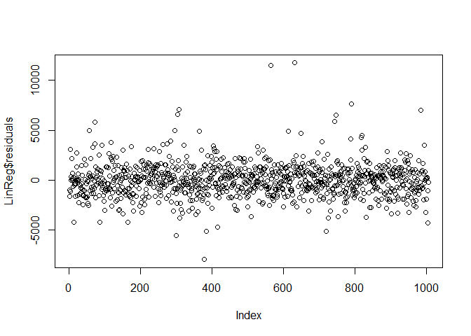

Simple Linear Regression
================
Aadil
28/09/2020

``` r
##----------------------------------------------------------------------------------##
##--- SIMPLE LINEAR REGRESSION MODEL building ------##
##----------------------------------------------------------------------------------##


##--- Step 1: Clear environment variables ------------------------------------------##
options(warn=-1)


##__________________________________________________________________________________##


##--- Step 2: Set working Directory ------------------------------------------------##

##setwd
getwd()
```

    ## [1] "E:/ML"

``` r
setwd("E:/ML")

##__________________________________________________________________________________##


##--- Step 3: Read the data from the csv file --------------------------------------##
car_data = read.csv(file="Toyota_SimpleReg.csv", header=T)
names(car_data)
```

    ## [1] "Id"        "Model"     "Price"     "Age_06_15"

``` r
str(car_data)
```

    ## 'data.frame':    1436 obs. of  4 variables:
    ##  $ Id       : int  1 2 3 4 5 6 7 8 9 10 ...
    ##  $ Model    : chr  "TOYOTA Corolla 2.0 D4D HATCHB TERRA 2/3-Doors" "TOYOTA Corolla 2.0 D4D HATCHB TERRA 2/3-Doors" " TOYOTA Corolla 2.0 D4D HATCHB TERRA 2/3-Doors" "TOYOTA Corolla 2.0 D4D HATCHB TERRA 2/3-Doors" ...
    ##  $ Price    : int  13500 13750 13950 14950 13750 12950 16900 18600 21500 12950 ...
    ##  $ Age_06_15: int  57 57 58 60 64 66 61 64 61 57 ...

``` r
summary(car_data)
```

    ##        Id            Model               Price         Age_06_15     
    ##  Min.   :   1.0   Length:1436        Min.   : 4350   Min.   : 35.00  
    ##  1st Qu.: 361.8   Class :character   1st Qu.: 8450   1st Qu.: 78.00  
    ##  Median : 721.5   Mode  :character   Median : 9900   Median : 95.00  
    ##  Mean   : 721.6                      Mean   :10731   Mean   : 89.95  
    ##  3rd Qu.:1081.2                      3rd Qu.:11950   3rd Qu.:104.00  
    ##  Max.   :1442.0                      Max.   :32500   Max.   :114.00

``` r
##__________________________________________________________________________________##

##--- Step 4: Perform Exploratory Data Analysis and Data Pre-processing-------------##
## Drop any irrelevant attribute(s):
car_data = car_data[-c(1,2)]

## Summary of the data and look for any missing values:
str(car_data)
```

    ## 'data.frame':    1436 obs. of  2 variables:
    ##  $ Price    : int  13500 13750 13950 14950 13750 12950 16900 18600 21500 12950 ...
    ##  $ Age_06_15: int  57 57 58 60 64 66 61 64 61 57 ...

``` r
summary(car_data)
```

    ##      Price         Age_06_15     
    ##  Min.   : 4350   Min.   : 35.00  
    ##  1st Qu.: 8450   1st Qu.: 78.00  
    ##  Median : 9900   Median : 95.00  
    ##  Mean   :10731   Mean   : 89.95  
    ##  3rd Qu.:11950   3rd Qu.:104.00  
    ##  Max.   :32500   Max.   :114.00

``` r
## Correlation and Covariance between the attributes:
cov(car_data)
```

    ##                 Price   Age_06_15
    ## Price     13154872.10 -59136.1089
    ## Age_06_15   -59136.11    345.9596

``` r
# Covarriance of proce is -59136.11
#Negitive relationship 

plot(car_data$Age_06_15, car_data$Price)
```

<!-- -->

``` r
plot(car_data$Age_06_15, car_data$Price, xlab= "Age of the car", ylab= "Price in $",pch=18,col = "red")
```

<!-- -->

``` r
cor(car_data)
```

    ##                Price  Age_06_15
    ## Price      1.0000000 -0.8765905
    ## Age_06_15 -0.8765905  1.0000000

``` r
cov(car_data$Age_06_15, car_data$Price)
```

    ## [1] -59136.11

``` r
#negitive co relation between age and price ie: -0.876 hence are strongly negitively corelated

#Do the attributes have a good enough correlation coefficient to support linear regres  sion model building?

##__________________________________________________________________________________##


##--- Step 5: Split the data into train and test datasets --------------------------##
#Split in (train:test) in (80:20) ratio
rows = seq(1, nrow(car_data),1)
set.seed(123)
trainRows = sample(rows,(70*nrow(car_data))/100)
car_train=car_data[trainRows,]
car_test=car_data[-trainRows,]

trainRows1 = sample(rows,(80*nrow(car_data))/100)
car_train1=car_data[trainRows1,]
car_test1=car_data[-trainRows1,]

trainRows2 = sample(rows,(90*nrow(car_data))/100)
car_train2=car_data[trainRows2,]
car_test2=car_data[-trainRows2,]


##__________________________________________________________________________________##


##--- Step 6: Linear regression model building--------------------------------------##
LinReg = lm(Price ~ Age_06_15,data = car_train)
LinReg
```

    ## 
    ## Call:
    ## lm(formula = Price ~ Age_06_15, data = car_train)
    ## 
    ## Coefficients:
    ## (Intercept)    Age_06_15  
    ##     25985.3       -170.1

``` r
coefficients(LinReg)
```

    ## (Intercept)   Age_06_15 
    ##   25985.348    -170.057

``` r
LinReg1 = lm(Price ~ Age_06_15,data = car_train1)
coefficients(LinReg1)
```

    ## (Intercept)   Age_06_15 
    ##  25637.1761   -166.1319

``` r
LinReg2 = lm(Price ~ Age_06_15,data = car_train2)
coefficients(LinReg2)
```

    ## (Intercept)   Age_06_15 
    ##  26000.0802   -169.6558

``` r
## Summary of model:
summary(LinReg)
```

    ## 
    ## Call:
    ## lm(formula = Price ~ Age_06_15, data = car_train)
    ## 
    ## Residuals:
    ##     Min      1Q  Median      3Q     Max 
    ## -7970.9  -941.0    -9.3   860.5 11751.8 
    ## 
    ## Coefficients:
    ##              Estimate Std. Error t value Pr(>|t|)    
    ## (Intercept) 25985.348    266.910   97.36   <2e-16 ***
    ## Age_06_15    -170.057      2.905  -58.53   <2e-16 ***
    ## ---
    ## Signif. codes:  0 '***' 0.001 '**' 0.01 '*' 0.05 '.' 0.1 ' ' 1
    ## 
    ## Residual standard error: 1689 on 1003 degrees of freedom
    ## Multiple R-squared:  0.7735, Adjusted R-squared:  0.7733 
    ## F-statistic:  3426 on 1 and 1003 DF,  p-value: < 2.2e-16

``` r
plot(LinReg$residuals)
```

<!-- -->

``` r
summary(LinReg)
```

    ## 
    ## Call:
    ## lm(formula = Price ~ Age_06_15, data = car_train)
    ## 
    ## Residuals:
    ##     Min      1Q  Median      3Q     Max 
    ## -7970.9  -941.0    -9.3   860.5 11751.8 
    ## 
    ## Coefficients:
    ##              Estimate Std. Error t value Pr(>|t|)    
    ## (Intercept) 25985.348    266.910   97.36   <2e-16 ***
    ## Age_06_15    -170.057      2.905  -58.53   <2e-16 ***
    ## ---
    ## Signif. codes:  0 '***' 0.001 '**' 0.01 '*' 0.05 '.' 0.1 ' ' 1
    ## 
    ## Residual standard error: 1689 on 1003 degrees of freedom
    ## Multiple R-squared:  0.7735, Adjusted R-squared:  0.7733 
    ## F-statistic:  3426 on 1 and 1003 DF,  p-value: < 2.2e-16

``` r
#Extract the intercept coefficient from the linear regression model


#Extract the residual values


##__________________________________________________________________________________##


##--- Step 7: Check for validity of linear regression assumptions ------------------##
#HINT: plot the 4 graphs to check. Write your comments
par(mfrow= c(2,2))
plot(LinReg)
```

<!-- -->

``` r
par(mfrow= c(1,1))
##__________________________________________________________________________________##


##--- Step 8: Predict on testdata --------------------------------------------------##
test_prediction = predict(LinReg,car_test)
test_prediction
```

    ##         1         3         7        14        15        21        22        27 
    ## 16292.101 16122.044 15611.873 14931.645 14761.588 15101.702 15271.759 15611.873 
    ##        30        32        33        43        47        50        53        54 
    ## 15101.702 16462.158 15611.873 16462.158 15611.873 14931.645 15781.930 15611.873 
    ##        57        59        60        62        63        65        66        70 
    ## 15441.816 16292.101 15101.702 15611.873 14931.645 15611.873 15781.930 15951.987 
    ##        73        82        85        87        92        97       101       102 
    ## 15441.816 15271.759 15951.987 15101.702 16802.272 16972.329 16802.272 16972.329 
    ##       104       107       110       113       114       116       118       123 
    ## 18332.785 17822.614 19523.183 18842.955 18842.955 18842.955 19013.012 17822.614 
    ##       125       131       132       135       136       140       146       147 
    ## 17312.443 16802.272 16802.272 16802.272 16972.329 16802.272 17482.500 16802.272 
    ##       149       150       154       157       173       175       176       181 
    ## 16972.329 17822.614 18162.728 17482.500 18842.955 18842.955 18842.955 19013.012 
    ##       182       183       184       187       188       192       198       203 
    ## 19013.012 19863.297 19863.297 12890.962 13741.247 12720.905 13571.190 13061.019 
    ##       213       214       216       219       226       228       231       233 
    ## 14421.474 13401.133 14591.531 12720.905 13741.247 14421.474 12720.905 13061.019 
    ##       245       246       249       253       254       257       260       267 
    ## 14591.531 13571.190 12890.962 12890.962 13061.019 13741.247 14591.531 12720.905 
    ##       268       272       273       274       276       283       284       288 
    ## 14421.474 13741.247 14251.417 14421.474 13231.076 13571.190 13401.133 13911.303 
    ##       295       296       299       300       305       306       307       308 
    ## 13061.019 13741.247 14251.417 13571.190 12720.905 13231.076 12720.905 13061.019 
    ##       313       314       317       322       324       325       333       338 
    ## 13061.019 13571.190 12720.905 14081.360 12720.905 13571.190 13741.247 13231.076 
    ##       340       346       350       351       353       354       356       359 
    ## 13061.019 13231.076 14591.531 13571.190 13741.247 13741.247 13571.190 12890.962 
    ##       360       361       362       363       364       368       369       371 
    ## 13231.076 13571.190 14251.417 13231.076 13401.133 13231.076 13911.303 13571.190 
    ##       377       388       390       394       395       399       404       406 
    ## 13571.190 12040.677 11020.335 10680.221 11700.563 10850.278 11870.620 11020.335 
    ##       408       410       414       417       418       427       428       429 
    ## 12210.734 11020.335 11530.506 11530.506 11020.335 11870.620 11020.335 11700.563 
    ##       435       438       439       440       442       443       453       454 
    ## 11870.620 12040.677 10850.278 11870.620 11700.563 12380.791 11870.620 11360.449 
    ##       465       472       476       483       486       495       496       497 
    ## 11870.620 10680.221 11020.335 11020.335 11700.563 11020.335 11360.449 11020.335 
    ##       501       505       506       509       510       513       518       521 
    ## 11530.506 12040.677 11020.335 11700.563 12380.791 11530.506 10680.221 11020.335 
    ##       527       543       546       550       552       556       558       559 
    ## 12040.677 11360.449 12210.734 12040.677 11360.449 11700.563 11020.335 12210.734 
    ##       568       569       570       571       572       573       574       580 
    ## 12040.677 11360.449 11870.620 12550.848 11360.449 10680.221 12040.677 12380.791 
    ##       582       585       587       590       596       600       603       609 
    ## 11360.449 10850.278 10850.278 10850.278 10680.221 11700.563 11360.449  9149.709 
    ##       613       614       621       629       630       632       636       638 
    ## 10170.050  9319.766  8639.538  9319.766  9999.993  8809.595  8639.538 10170.050 
    ##       641       644       645       659       661       663       675       676 
    ##  8639.538 10510.164  9319.766  8639.538  9659.879  9829.936  8639.538 10340.107 
    ##       684       689       694       702       703       704       705       707 
    ##  9489.822 10170.050  9149.709  8979.652  9489.822  9149.709  9149.709  9659.879 
    ##       716       717       718       728       731       732       733       735 
    ##  9659.879  9999.993  9319.766 10170.050  9149.709  9659.879  9999.993  9149.709 
    ##       737       738       739       745       748       751       754       760 
    ##  8639.538  9659.879  8809.595  9149.709  9149.709  9829.936 10170.050  9659.879 
    ##       761       764       766       768       771       781       783       790 
    ##  9999.993  8809.595  9999.993 10510.164  9319.766  9829.936 10170.050  9659.879 
    ##       798       800       801       804       810       812       815       820 
    ##  8639.538  9149.709  8809.595  9319.766  9319.766 10170.050  9999.993  9999.993 
    ##       823       824       825       826       830       832       833       837 
    ##  9149.709  8809.595  8639.538  8639.538 10340.107  9489.822  9489.822  8639.538 
    ##       838       841       843       853       854       857       858       871 
    ##  8809.595  8639.538  9829.936  9319.766  8639.538  8639.538  9999.993  9149.709 
    ##       874       875       880       881       882       883       889       892 
    ##  8639.538  9149.709  9659.879 10510.164  8639.538  8639.538  9829.936  8639.538 
    ##       893       894       895       897       899       900       901       908 
    ## 10510.164  9149.709 10170.050  8809.595  9149.709  9659.879  9149.709  9149.709 
    ##       911       912       915       916       917       921       925       935 
    ##  9999.993  9319.766 10340.107  9659.879  8639.538  9829.936  9489.822  9149.709 
    ##       939       941       948       952       958       959       961       963 
    ##  8809.595  9829.936  8639.538 10510.164  9829.936  9149.709  8979.652  9829.936 
    ##       965       967       969       970       971       972       978       980 
    ##  9149.709  9659.879  9489.822  9659.879  9489.822  8639.538  9489.822  9149.709 
    ##       994       996      1010      1020      1022      1024      1027      1030 
    ## 10510.164  8639.538 10170.050  9319.766  8639.538  9149.709  9999.993 10340.107 
    ##      1039      1043      1045      1048      1049      1050      1051      1053 
    ##  8979.652  8809.595  7789.253  6768.911  7619.196  7109.025  8469.481  7279.082 
    ##      1058      1059      1065      1077      1084      1085      1086      1087 
    ##  6938.968  7109.025  7619.196  7109.025  8129.367  7789.253  6768.911  7109.025 
    ##      1091      1099      1100      1103      1104      1106      1110      1116 
    ##  6598.854  8299.424  7279.082  7449.139  7619.196  7109.025  7279.082  8129.367 
    ##      1117      1119      1121      1122      1127      1129      1130      1131 
    ##  6938.968  7789.253  7959.310  7789.253  6598.854  6938.968  8129.367  7789.253 
    ##      1132      1133      1136      1138      1139      1146      1148      1155 
    ##  7449.139  7619.196  7959.310  6598.854  7279.082  7449.139  7449.139  6598.854 
    ##      1157      1161      1162      1163      1168      1169      1171      1172 
    ##  6768.911  8129.367  7109.025  6598.854  7619.196  6938.968  6938.968  6768.911 
    ##      1177      1181      1184      1186      1193      1199      1201      1206 
    ##  6598.854  7109.025  6598.854  8299.424  7109.025  7449.139  7619.196  7449.139 
    ##      1207      1211      1215      1217      1221      1226      1231      1241 
    ##  7789.253  7789.253  6768.911  8299.424  8299.424  7619.196  6598.854  6598.854 
    ##      1243      1246      1251      1252      1254      1255      1256      1257 
    ##  6768.911  7109.025  7109.025  8129.367  7109.025  6938.968  7449.139  7279.082 
    ##      1259      1263      1264      1270      1275      1277      1279      1283 
    ##  6598.854  7959.310  6938.968  8469.481  6598.854  7449.139  8129.367  6598.854 
    ##      1290      1295      1296      1300      1301      1303      1307      1318 
    ##  6938.968  6598.854  6598.854  7959.310  7279.082  7109.025  7279.082  7279.082 
    ##      1321      1322      1324      1327      1328      1331      1334      1336 
    ##  8469.481  6598.854  6598.854  6598.854  6938.968  8129.367  7449.139  6598.854 
    ##      1339      1342      1349      1350      1351      1353      1356      1358 
    ##  6598.854  6598.854  6768.911  8299.424  7279.082  7959.310  8469.481  7279.082 
    ##      1359      1365      1381      1382      1385      1387      1392      1397 
    ##  7279.082  7619.196  6768.911  7109.025  7109.025  8469.481  8299.424  7109.025 
    ##      1400      1402      1405      1406      1409      1413      1417      1419 
    ##  7619.196  8129.367  7109.025  7279.082  6598.854  8469.481  6768.911  7789.253 
    ##      1421      1425      1426      1427      1428      1433      1434 
    ##  7279.082  7789.253  6598.854  6938.968  8129.367  7959.310  8129.367

``` r
plot(test_prediction)
```

<!-- -->

``` r
test_actual= car_test$Price
plot(test_actual)
##__________________________________________________________________________________##


##--- Step 9: Error Metrics --------------------------------------------------------##
library(DMwR)
```

    ## Loading required package: lattice

    ## Loading required package: grid

    ## Registered S3 method overwritten by 'quantmod':
    ##   method            from
    ##   as.zoo.data.frame zoo

<!-- -->

``` r
#Error verification on train data
regr.eval(car_train$Price,LinReg$fitted.values)
```

    ##          mae          mse         rmse         mape 
    ## 1.216922e+03 2.845463e+06 1.686850e+03 1.186451e-01

``` r
plot(regr.eval(car_train$Price,LinReg$fitted.values))
```

<!-- -->

``` r
#Error verification on test data

regr.eval(test_actual,test_prediction)
```

    ##          mae          mse         rmse         mape 
    ## 1.307160e+03 3.514942e+06 1.874818e+03 1.250985e-01

``` r
##__________________________________________________________________________________##


##--- Step 10: Confidence and Prediction Intervals----------------------------------##
#Find the confidence and prediction intervals and plot them for the WHOLE dataset
Conf_pred = data.frame(predict(LinReg,car_test,interval = "confidence",level = 0.95))
Pred_pred = data.frame(predict(LinReg,car_test,interval = "prediction",level = 0.95))
str(Conf_pred)
```

    ## 'data.frame':    431 obs. of  3 variables:
    ##  $ fit: num  16292 16122 15612 14932 14762 ...
    ##  $ lwr: num  16077 15912 15416 14755 14589 ...
    ##  $ upr: num  16507 16332 15808 15108 14934 ...

``` r
summary(Conf_pred)
```

    ##       fit             lwr             upr       
    ##  Min.   : 6599   Min.   : 6427   Min.   : 6771  
    ##  1st Qu.: 8129   1st Qu.: 7994   1st Qu.: 8264  
    ##  Median : 9830   Median : 9722   Median : 9938  
    ##  Mean   :10719   Mean   :10574   Mean   :10864  
    ##  3rd Qu.:13061   3rd Qu.:12929   3rd Qu.:13193  
    ##  Max.   :19863   Max.   :19538   Max.   :20189

``` r
plot(Conf_pred)
```

<!-- -->

``` r
plot(car_test$Age_06_15, car_test$Price, xlab = "Age of car", ylab="Price in $")

points(car_test$Age_06_15,Conf_pred$fit,type = "l",col="green",lwd=2)
points(car_test$Age_06_15,Conf_pred$lwr,pch = "-",col="red",lwd=4)
points(car_test$Age_06_15,Conf_pred$upr,pch = "-",col="red",lwd=4)
points(car_test$Age_06_15,Conf_pred$lwr,pch = "-",col="blue",lwd=4)
points(car_test$Age_06_15,Conf_pred$Supr,pch = "-",col="red",lwd=4)
```

<!-- -->

``` r
##__________________________________________________________________________________##
#-----------------------end---------------------------------------------------------##rm(list = ls(all=TRUE))
```
